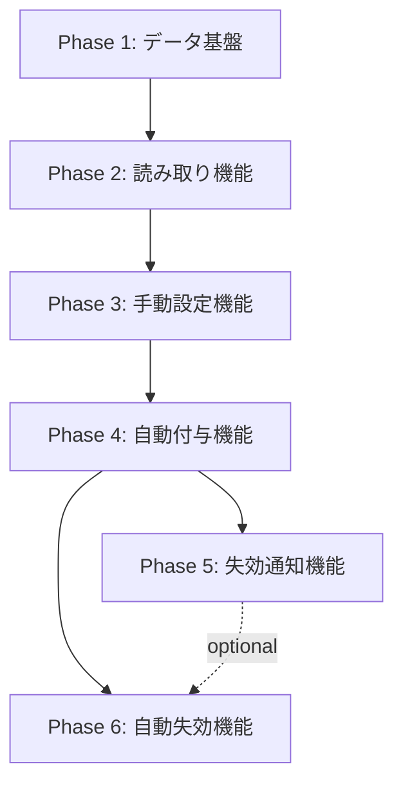

# civicship-api 段階的デリバリー計画

大きな機能を**段階的にリリース可能な単位**に分割し、リスクを最小化したデリバリー計画を策定します。フィーチャーフラグ、ロールバック計画、成功指標を含む実行可能なプランを生成します。

## 使用方法

```bash
# 要件定義書から段階的計画を生成
/phased-delivery-plan docs/requirements/point-expiration.md

# 衝突レポートを踏まえた計画生成
/phased-delivery-plan "ポイント有効期限機能" --with-conflicts
```

**引数:**
- `$ARGUMENTS`: 要件定義書のパス、または機能名
- `--with-conflicts`: `/check-requirement-delta` の結果を考慮

---

## デリバリー計画プロセス

### ステップ1: 機能の分解（Feature Decomposition）

大きな機能を**独立してリリース可能な小さな単位**に分割:

```markdown
## 機能分解

### 最終ゴール
「ポイント有効期限機能」を完全に実装

### 分解単位（Vertical Slices）

#### Phase 1: データ基盤（Infrastructure）
**目的:** 有効期限データを保存できるようにする
**スコープ:**
- Prismaスキーマ変更（`t_wallets.expiresAt` 追加）
- マイグレーション実行
- GraphQL型追加（`GqlWallet.expiresAt`）

**価値:**
- ユーザーには見えない（内部変更のみ）
- 次フェーズの前提条件

**リスク:** 🟢 Low
- 既存機能への影響なし
- ロールバック容易（カラム追加のみ）

---

#### Phase 2: 読み取り機能（Read-Only）
**目的:** 有効期限を表示できるようにする
**スコープ:**
- GraphQL Query に `expiresAt` フィールドを追加
- フロントエンドでの表示対応

**価値:**
- ユーザーがポイント有効期限を確認できる
- 運営が手動で有効期限を設定し、効果を確認できる

**リスク:** 🟢 Low
- 読み取りのみ（データ変更なし）
- 既存機能に影響なし

---

#### Phase 3: 手動設定機能（Manual）
**目的:** 管理者が手動で有効期限を設定できるようにする
**スコープ:**
- GraphQL Mutation `walletSetExpiration` 追加
- 管理画面での設定UI

**価値:**
- 特定のキャンペーンで有効期限を試験運用
- 小規模でのフィードバック収集

**リスク:** 🟡 Medium
- 手動設定による人為ミスの可能性
- ロールバック可能（設定を削除すればOK）

---

#### Phase 4: 自動付与機能（Automated）
**目的:** ポイント付与時に自動的に有効期限を設定
**スコープ:**
- WalletService に有効期限ロジック追加
- デフォルト有効期限の設定（例: 付与から1年）

**価値:**
- 全ポイントに自動的に有効期限が付与される
- 運用コストの削減

**リスク:** 🟡 Medium
- ビジネスロジックの変更
- 既存のポイント付与フローに影響

---

#### Phase 5: 失効通知機能（Notification）
**目的:** 有効期限切れ前にユーザーに通知
**スコープ:**
- バッチ処理で有効期限7日前のポイントを検出
- LINE通知送信

**価値:**
- ユーザーエクスペリエンスの向上
- ポイント失効の不満軽減

**リスク:** 🟢 Low
- 通知のみ（データ変更なし）
- 失敗しても本質的な機能に影響なし

---

#### Phase 6: 自動失効機能（Expiration）
**目的:** 有効期限切れポイントを自動的に失効
**スコープ:**
- バッチ処理で有効期限切れポイントを検出
- ポイント残高から減算

**価値:**
- 完全な有効期限機能の実現
- 運用の自動化

**リスク:** 🔴 High
- ポイント残高の変更（不可逆）
- ユーザーの資産に直接影響
- ロールバック困難
```

---

### ステップ2: フェーズ間の依存関係

各フェーズの依存関係を明確化:



**依存関係ルール:**
- Phase N は Phase N-1 が完了するまで開始不可
- Phase 5 と Phase 6 は並行実装可能
- Phase 6 は Phase 5 なしでも実装可能（推奨はセット）

---

### ステップ3: フィーチャーフラグ戦略

各フェーズをフィーチャーフラグで制御:

```markdown
## フィーチャーフラグ設計

### 環境変数ベースのフラグ

**ファイル:** `src/config/features.ts`

\`\`\`typescript
export const FEATURE_FLAGS = {
  // Phase 2: 有効期限の表示
  WALLET_EXPIRATION_DISPLAY: process.env.FEATURE_WALLET_EXPIRATION_DISPLAY === "true",

  // Phase 3: 手動設定
  WALLET_EXPIRATION_MANUAL_SET: process.env.FEATURE_WALLET_EXPIRATION_MANUAL_SET === "true",

  // Phase 4: 自動付与
  WALLET_EXPIRATION_AUTO_SET: process.env.FEATURE_WALLET_EXPIRATION_AUTO_SET === "true",

  // Phase 5: 失効通知
  WALLET_EXPIRATION_NOTIFICATION: process.env.FEATURE_WALLET_EXPIRATION_NOTIFICATION === "true",

  // Phase 6: 自動失効
  WALLET_EXPIRATION_AUTO_EXPIRE: process.env.FEATURE_WALLET_EXPIRATION_AUTO_EXPIRE === "true"
} as const;
\`\`\`

---

### GraphQLスキーマでのフラグ制御

\`\`\`typescript
// Resolver でフラグチェック
Query = {
  wallet: async (_, { id }, ctx) => {
    const wallet = await this.usecase.getWallet(id, ctx);

    // Phase 2 のフラグが OFF の場合、expiresAt を除外
    if (!FEATURE_FLAGS.WALLET_EXPIRATION_DISPLAY) {
      delete wallet.expiresAt;
    }

    return wallet;
  }
};

Mutation = {
  walletSetExpiration: async (_, { input }, ctx) => {
    // Phase 3 のフラグチェック
    if (!FEATURE_FLAGS.WALLET_EXPIRATION_MANUAL_SET) {
      throw new Error("FEATURE_NOT_ENABLED");
    }

    return this.usecase.setExpiration(input, ctx);
  }
};
\`\`\`

---

### フラグの段階的有効化

| Phase | 開発環境 | ステージング | 本番（10%） | 本番（50%） | 本番（100%） |
|-------|---------|------------|------------|------------|-------------|
| Phase 1 | Week 1 | Week 2 | - | - | Week 2 |
| Phase 2 | Week 2 | Week 3 | Week 4 | Week 5 | Week 6 |
| Phase 3 | Week 3 | Week 4 | Week 5 | Week 6 | Week 7 |
| Phase 4 | Week 5 | Week 6 | Week 7 | Week 8 | Week 9 |
| Phase 5 | Week 6 | Week 7 | Week 8 | - | Week 9 |
| Phase 6 | Week 7 | Week 8 | Week 9 | Week 10 | Week 11 |

**ロールアウト戦略:**
1. **開発環境:** 即座に有効化
2. **ステージング:** 1週間後に有効化
3. **本番（10%）:** カナリアリリース、特定コミュニティのみ
4. **本番（50%）:** 問題なければ半数に展開
5. **本番（100%）:** 全ユーザーに展開
```

---

### ステップ4: リスク評価とロールバック計画

各フェーズのリスクとロールバック手順を定義:

```markdown
## リスク評価とロールバック計画

### Phase 1: データ基盤

**リスク:** 🟢 Low
- マイグレーション失敗の可能性: 5%
- 既存データへの影響: なし

**ロールバック手順:**
1. マイグレーションのロールバック
   \`\`\`bash
   pnpm db:migrate-rollback
   \`\`\`
2. Prisma Client の再生成
   \`\`\`bash
   pnpm db:generate
   \`\`\`
3. アプリケーション再起動

**ロールバック所要時間:** 5分

---

### Phase 2: 読み取り機能

**リスク:** 🟢 Low
- GraphQLスキーマの破壊的変更: なし（フィールド追加のみ）
- パフォーマンス影響: なし

**ロールバック手順:**
1. フィーチャーフラグを OFF
   \`\`\`bash
   export FEATURE_WALLET_EXPIRATION_DISPLAY=false
   \`\`\`
2. アプリケーション再起動（またはホットリロード）

**ロールバック所要時間:** 1分

---

### Phase 3: 手動設定機能

**リスク:** 🟡 Medium
- 管理者の誤操作: 30%
- 意図しない有効期限設定: 20%

**ロールバック手順:**
1. フィーチャーフラグを OFF
2. 誤って設定された有効期限をクリア
   \`\`\`sql
   UPDATE t_wallets SET expiresAt = NULL WHERE expiresAt < NOW();
   \`\`\`

**ロールバック所要時間:** 10分

**リスク軽減策:**
- 管理画面に確認ダイアログを追加
- 有効期限設定の監査ログ記録
- 設定前にプレビュー機能

---

### Phase 4: 自動付与機能

**リスク:** 🟡 Medium
- ビジネスロジックのバグ: 25%
- 全ポイントに影響: High Impact

**ロールバック手順:**
1. フィーチャーフラグを OFF
   \`\`\`bash
   export FEATURE_WALLET_EXPIRATION_AUTO_SET=false
   \`\`\`
2. 誤って設定された有効期限をクリア
   \`\`\`sql
   UPDATE t_wallets SET expiresAt = NULL WHERE createdAt > 'YYYY-MM-DD';
   \`\`\`

**ロールバック所要時間:** 15分

**リスク軽減策:**
- ステージング環境で十分なテスト
- カナリアリリース（10% → 50% → 100%）
- リアルタイム監視（有効期限設定数のメトリクス）

---

### Phase 5: 失効通知機能

**リスク:** 🟢 Low
- 通知送信失敗: 10%
- 過剰な通知: 15%

**ロールバック手順:**
1. フィーチャーフラグを OFF
   \`\`\`bash
   export FEATURE_WALLET_EXPIRATION_NOTIFICATION=false
   \`\`\`
2. バッチ処理の停止

**ロールバック所要時間:** 5分

**リスク軽減策:**
- 通知送信のレート制限
- ユーザーごとの通知頻度制御（1日1回まで）
- オプトアウト機能

---

### Phase 6: 自動失効機能

**リスク:** 🔴 High
- ポイント残高の誤減算: 15%
- ユーザー資産への影響: Critical Impact
- ロールバック困難: 失効したポイントは復元困難

**ロールバック手順:**
1. **即座にフラグOFF**
   \`\`\`bash
   export FEATURE_WALLET_EXPIRATION_AUTO_EXPIRE=false
   \`\`\`
2. **バッチ処理の緊急停止**
3. **影響調査**
   \`\`\`sql
   SELECT userId, SUM(amount) as expiredPoints
   FROM t_point_expiration_logs
   WHERE executedAt > 'YYYY-MM-DD HH:MM:SS'
   GROUP BY userId;
   \`\`\`
4. **ポイント復元（可能な場合）**
   \`\`\`sql
   -- 失効ログから復元
   INSERT INTO t_point_transactions (userId, amount, type, reason)
   SELECT userId, amount, 'REFUND', 'Expiration rollback'
   FROM t_point_expiration_logs
   WHERE executedAt > 'YYYY-MM-DD HH:MM:SS';
   \`\`\`

**ロールバック所要時間:** 30分〜2時間

**リスク軽減策:**
- **失効ログの記録:** 失効前に別テーブルにログ保存
  \`\`\`prisma
  model t_point_expiration_logs {
    id          String   @id @default(cuid())
    userId      String
    amount      Int
    expiresAt   DateTime
    executedAt  DateTime @default(now())
  }
  \`\`\`
- **ドライラン:** 本番実行前にシミュレーション
- **段階的実行:** 1日100ユーザーずつなど、少数から開始
- **手動承認:** 最初の1ヶ月は自動実行せず、管理者が確認後に実行
```

---

### ステップ5: 成功指標（KPI）の設定

各フェーズの成功を測定する指標:

```markdown
## フェーズごとの成功指標

### Phase 1: データ基盤

**技術指標:**
- [ ] マイグレーション成功率: 100%
- [ ] TypeScriptコンパイルエラー: 0件
- [ ] テストカバレッジ: 変更なし

**判断基準:**
- 全ての指標が基準を満たせば Phase 2 へ進む

---

### Phase 2: 読み取り機能

**技術指標:**
- [ ] GraphQLクエリエラー率: < 0.1%
- [ ] レスポンスタイム劣化: < 5%
- [ ] N+1クエリ: 検出されない

**ビジネス指標:**
- [ ] ユーザーからの問い合わせ: 0件
- [ ] クライアントアプリのクラッシュ: 0件

**判断基準:**
- 1週間の本番運用で問題なければ Phase 3 へ進む

---

### Phase 3: 手動設定機能

**技術指標:**
- [ ] Mutationエラー率: < 1%
- [ ] 有効期限設定の成功率: > 99%

**ビジネス指標:**
- [ ] 管理者の操作ミス: < 5%
- [ ] ユーザーからの問い合わせ: < 10件/週

**判断基準:**
- 2週間の運用で問題なければ Phase 4 へ進む
- 操作ミスが多い場合はUIを改善

---

### Phase 4: 自動付与機能

**技術指標:**
- [ ] 有効期限自動設定の成功率: > 99.9%
- [ ] ポイント付与のエラー率: < 0.1%

**ビジネス指標:**
- [ ] ユーザーからの苦情: < 5件/週
- [ ] 有効期限に関する問い合わせ: < 20件/週

**判断基準:**
- カナリアリリース（10%）で1週間問題なければ 50% へ
- 50% で1週間問題なければ 100% へ

---

### Phase 5: 失効通知機能

**技術指標:**
- [ ] LINE通知送信成功率: > 95%
- [ ] バッチ処理の実行時間: < 10分

**ビジネス指標:**
- [ ] 通知のオプトアウト率: < 10%
- [ ] ユーザーエンゲージメント: 通知後のアプリ起動率 > 20%

**判断基準:**
- オプトアウト率が高い場合は通知内容を見直し
- 問題なければ Phase 6 へ進む

---

### Phase 6: 自動失効機能

**技術指標:**
- [ ] 失効処理の成功率: 100%（エラー許容なし）
- [ ] 失効ログの記録率: 100%

**ビジネス指標:**
- [ ] ユーザーからの苦情: < 10件/週
- [ ] ポイント失効に関する問い合わせ: < 30件/週
- [ ] ポイント復元リクエスト: < 5件/週

**判断基準:**
- 最初の1ヶ月は手動承認制
- 問題なければ完全自動化へ移行
```

---

### ステップ6: デリバリースケジュール

具体的なスケジュールとマイルストーン:

```markdown
## デリバリースケジュール

### 全体スケジュール（11週間）

| Week | Phase | タスク | 環境 | マイルストーン |
|------|-------|--------|------|---------------|
| 1 | Phase 1 | データ基盤実装 | 開発 | スキーマ変更完了 |
| 2 | Phase 1 | マイグレーション実行 | 本番 | 🎯 データ基盤リリース |
| 2-3 | Phase 2 | 読み取り機能実装 | 開発 | GraphQL対応完了 |
| 3-4 | Phase 2 | フロントエンド対応 | ステージング | UI実装完了 |
| 4-6 | Phase 2 | カナリアリリース | 本番 | 🎯 読み取り機能リリース |
| 3-4 | Phase 3 | 手動設定実装 | 開発 | 管理画面実装完了 |
| 5-7 | Phase 3 | 試験運用 | 本番 | 🎯 手動設定リリース |
| 5-6 | Phase 4 | 自動付与実装 | 開発 | ロジック実装完了 |
| 7-9 | Phase 4 | カナリアリリース | 本番 | 🎯 自動付与リリース |
| 6-7 | Phase 5 | 失効通知実装 | 開発 | バッチ処理実装完了 |
| 8-9 | Phase 5 | 通知配信開始 | 本番 | 🎯 失効通知リリース |
| 7-8 | Phase 6 | 自動失効実装 | 開発 | 失効ロジック実装完了 |
| 9-11 | Phase 6 | 手動承認期間 | 本番 | 🎯 自動失効リリース |

---

### 週次の詳細スケジュール

#### Week 1-2: Phase 1 データ基盤

**Day 1-2:**
- [ ] Prismaスキーマ変更
- [ ] マイグレーションファイル作成
- [ ] GraphQL型定義追加

**Day 3-4:**
- [ ] 開発環境でマイグレーション実行
- [ ] ユニットテスト作成
- [ ] コードレビュー

**Day 5:**
- [ ] ステージング環境へデプロイ
- [ ] 統合テスト実行

**Week 2 Monday:**
- [ ] 🚀 本番環境へマイグレーション実行
- [ ] 監視開始

**判断ポイント:**
- マイグレーション成功 → Phase 2 へ進む
- 失敗 → ロールバック、原因調査

---

#### Week 2-6: Phase 2 読み取り機能

**Week 2-3:**
- [ ] GraphQL Resolver実装
- [ ] フロントエンド対応
- [ ] E2Eテスト作成

**Week 4:**
- [ ] 🚀 カナリアリリース（10%）
- [ ] メトリクス監視
- [ ] ユーザーフィードバック収集

**Week 5:**
- [ ] 🚀 50% ロールアウト
- [ ] パフォーマンス監視

**Week 6:**
- [ ] 🚀 100% ロールアウト
- [ ] 🎯 Phase 2 完了

**判断ポイント:**
- エラー率 < 0.1% → 次へ進む
- エラー率 > 1% → ロールバック

---

[Week 7-11: Phase 3-6 の詳細スケジュール...]

---

### マイルストーン一覧

| # | マイルストーン | 完了条件 | 予定日 |
|---|---------------|---------|--------|
| 1 | データ基盤リリース | マイグレーション成功 | Week 2 |
| 2 | 読み取り機能リリース | 100%ロールアウト完了 | Week 6 |
| 3 | 手動設定リリース | 管理者が使用可能 | Week 7 |
| 4 | 自動付与リリース | 全ポイントに自動設定 | Week 9 |
| 5 | 失効通知リリース | 通知配信開始 | Week 9 |
| 6 | 自動失効リリース | 完全自動化 | Week 11 |
```

---

### ステップ7: チーム間の調整

各フェーズでの関係者とコミュニケーション:

```markdown
## チーム間の調整

### Phase 1: データ基盤

**関係者:**
- バックエンドチーム（実装担当）
- インフラチーム（マイグレーション実行）

**コミュニケーション:**
- Week 1 Monday: キックオフミーティング
- Week 1 Friday: コードレビュー
- Week 2 Monday: 本番マイグレーション立ち会い

---

### Phase 2: 読み取り機能

**関係者:**
- バックエンドチーム
- フロントエンドチーム（iOS, Android, Web）
- QAチーム

**コミュニケーション:**
- Week 2: GraphQL API仕様の共有
- Week 3: フロントエンド実装進捗確認
- Week 4: カナリアリリース前のリハーサル

---

### Phase 3-6: 以降のフェーズ

**関係者:**
- 全開発チーム
- プロダクトオーナー
- カスタマーサポート

**コミュニケーション:**
- 週次の進捗報告
- リリース前のステークホルダーレビュー
- リリース後の振り返り
```

---

### ステップ8: 監視とアラート

各フェーズの監視項目:

```markdown
## 監視とアラート設定

### Phase 1: データ基盤

**監視項目:**
- マイグレーション実行時間
- データベース接続エラー

**アラート:**
- マイグレーション失敗時に即座通知

---

### Phase 2: 読み取り機能

**監視項目:**
- GraphQLクエリエラー率
- `wallet.expiresAt` フィールドのnull率
- レスポンスタイム（P50, P95, P99）

**アラート:**
- エラー率 > 1% で警告
- エラー率 > 5% で緊急通知（自動ロールバック検討）

---

### Phase 4: 自動付与機能

**監視項目:**
- 有効期限自動設定数（時間別）
- 設定失敗数
- 平均有効期限日数

**アラート:**
- 設定失敗率 > 1% で警告
- 平均有効期限が異常値（< 1日 or > 5年）で緊急通知

**ダッシュボード:**
```typescript
// Datadog / Grafana
metrics.increment("wallet.expiration.auto_set", {
  status: "success",
  duration_days: expirationDays
});
```

---

### Phase 6: 自動失効機能

**監視項目:**
- 失効処理実行数
- 失効ポイント総額
- 失効ユーザー数

**アラート:**
- 失効ユーザー数 > 100/日 で警告（異常値の可能性）
- 失効処理失敗で即座緊急通知
- 失効ポイント総額 > 100万pt/日 で確認通知

**ダッシュボード:**
```typescript
metrics.increment("wallet.expiration.executed", {
  user_count: expiredUserCount,
  total_points: totalExpiredPoints
});
```
```

---

### ステップ9: ドキュメント更新計画

各フェーズでのドキュメント更新:

```markdown
## ドキュメント更新計画

### Phase 1: データ基盤

**更新対象:**
- [ ] `prisma/schema.prisma` のコメント
- [ ] `docs/database/schema.md` にテーブル仕様追加
- [ ] `CHANGELOG.md` にマイグレーション記録

---

### Phase 2: 読み取り機能

**更新対象:**
- [ ] GraphQLスキーマのdescription
- [ ] `docs/api/graphql.md` にフィールド説明追加
- [ ] フロントエンド向けAPI仕様書

---

### Phase 4: 自動付与機能

**更新対象:**
- [ ] `README.md` に機能説明追加
- [ ] `docs/handbook/FEATURES.md` に詳細仕様追加
- [ ] 運用マニュアル（有効期限の設定方法）

---

### Phase 6: 自動失効機能

**更新対象:**
- [ ] ユーザー向けFAQ
- [ ] カスタマーサポート向けマニュアル
- [ ] 利用規約（ポイント有効期限に関する条項）
```

---

### ステップ10: デリバリープランサマリー

全体像を1ページにまとめたサマリー:

```markdown
# デリバリープランサマリー

**機能名:** ポイント有効期限機能
**総工数:** 11週間
**総リスク評価:** 🟡 Medium

---

## フェーズ一覧

| Phase | 期間 | リスク | 依存関係 | ロールバック |
|-------|------|--------|----------|-------------|
| 1. データ基盤 | Week 1-2 | 🟢 Low | なし | 5分 |
| 2. 読み取り機能 | Week 2-6 | 🟢 Low | Phase 1 | 1分 |
| 3. 手動設定 | Week 3-7 | 🟡 Medium | Phase 2 | 10分 |
| 4. 自動付与 | Week 5-9 | 🟡 Medium | Phase 3 | 15分 |
| 5. 失効通知 | Week 6-9 | 🟢 Low | Phase 4 | 5分 |
| 6. 自動失効 | Week 7-11 | 🔴 High | Phase 4 | 30分〜2時間 |

---

## リスク緩和策

### 🔴 High Risk: Phase 6 自動失効
- 失効ログの記録（復元用）
- ドライラン（シミュレーション）
- 手動承認期間（1ヶ月）
- 段階的実行（100ユーザー/日から開始）

### 🟡 Medium Risk: Phase 3-4
- フィーチャーフラグによる制御
- カナリアリリース（10% → 50% → 100%）
- リアルタイム監視とアラート

---

## 成功の定義

### 技術的成功
- [ ] 全フェーズで本番エラー率 < 1%
- [ ] ロールバック実行回数: 0回
- [ ] パフォーマンス劣化: < 5%

### ビジネス的成功
- [ ] ユーザーからの苦情: < 50件（全期間）
- [ ] ポイント失効に関する問い合わせ: < 100件/月
- [ ] 機能利用率: 有効期限付きポイント > 80%

---

## 中止・延期の判断基準

以下の条件に該当する場合、次フェーズへの進行を中止:

- [ ] エラー率 > 5% が24時間継続
- [ ] Critical な障害発生
- [ ] ユーザーからの苦情 > 100件/週
- [ ] ロールバック失敗

**中止時のアクション:**
1. 即座にフィーチャーフラグOFF
2. 全ステークホルダーへの通知
3. 原因調査と対策会議
4. 再開判断（修正後に再審査）

---

## 承認

**プランレビュー担当者:**
- [ ] プロダクトオーナー
- [ ] テックリード
- [ ] インフラリード
- [ ] QAリード

**承認日:** YYYY-MM-DD
```

---

## 活用例

### 例1: ポイント有効期限機能

```bash
/phased-delivery-plan "ポイント有効期限機能"
```

**生成される計画:**
- 6フェーズ、11週間のデリバリープラン
- フィーチャーフラグ設定
- 各フェーズのロールバック手順
- 監視・アラート設定

---

### 例2: 複数ウォレット対応

```bash
/phased-delivery-plan docs/requirements/multi-wallet.md --with-conflicts
```

**生成される計画:**
- `/check-requirement-delta` で検出された衝突を考慮
- 破壊的変更を最小化する段階的移行
- 非推奨化期間の設定（6ヶ月）
- クライアント移行のスケジュール

---

## 注意事項

### デリバリープランの原則

- ✅ **小さく始める:** 最初のフェーズは最小機能
- ✅ **価値を早く届ける:** 各フェーズでビジネス価値を提供
- ✅ **リスクを分散:** High Riskは最後のフェーズに
- ✅ **ロールバック可能:** 各フェーズで後戻り可能に
- ✅ **測定可能:** 成功指標を明確に

### よくある失敗

- ❌ **大きすぎるフェーズ:** 1フェーズ > 2週間は分割検討
- ❌ **依存関係の無視:** Phase N が Phase N+1 に依存
- ❌ **ロールバック不可:** 不可逆な変更を最初に実施
- ❌ **監視なし:** メトリクスを取らずにリリース

---

## 参考資料

以下については `@CLAUDE.md` を参照してください:
- フィーチャーフラグの実装
- カナリアリリースの方法
- 監視・アラート設定
- ロールバック手順
