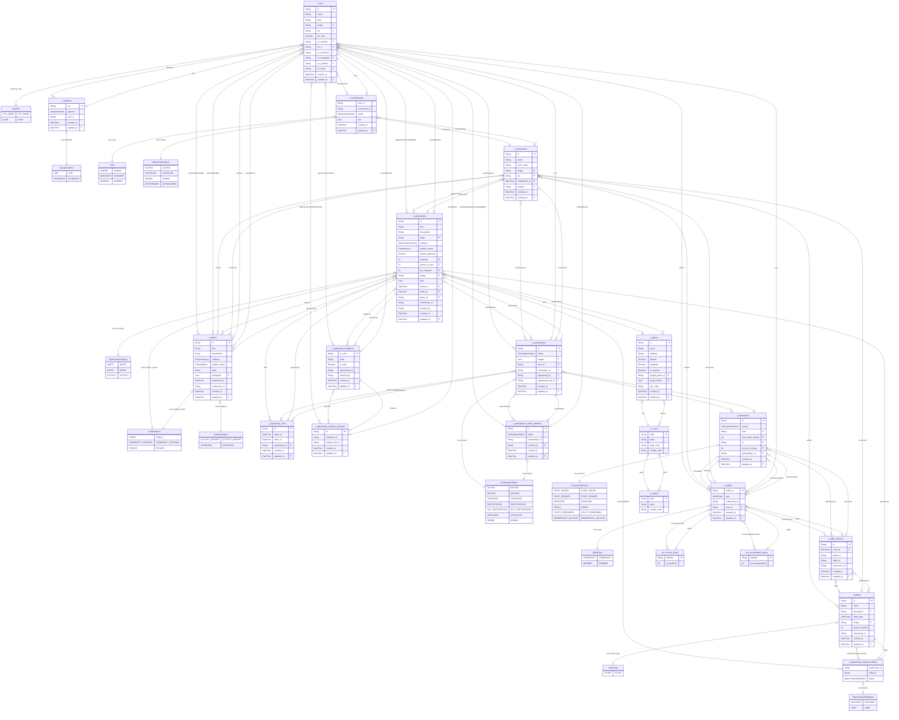

```mermaid
erDiagram

        IdentityPlatform {
            LINE LINE
FACEBOOK FACEBOOK
        }
    


        SysRole {
            SYS_ADMIN SYS_ADMIN
USER USER
        }
    


        Role {
            OWNER OWNER
MANAGER MANAGER
MEMBER MEMBER
        }
    


        PublishStatus {
            PUBLIC PUBLIC
COMMUNITY_INTERNAL COMMUNITY_INTERNAL
PRIVATE PRIVATE
        }
    


        OpportunityCategory {
            QUEST QUEST
EVENT EVENT
ACTIVITY ACTIVITY
        }
    


        ArticleCategory {
            ACTIVITY_REPORT ACTIVITY_REPORT
INTERVIEW INTERVIEW
        }
    


        MembershipStatus {
            INVITED INVITED
CANCELED CANCELED
JOINED JOINED
WITHDRAWED WITHDRAWED
        }
    


        ParticipationStatus {
            INVITED INVITED
APPLIED APPLIED
CANCELED CANCELED
PARTICIPATING PARTICIPATING
NOT_PARTICIPATING NOT_PARTICIPATING
APPROVED APPROVED
DENIED DENIED
        }
    


        WalletType {
            COMMUNITY COMMUNITY
MEMBER MEMBER
        }
    


        OpportunityUtilityStatus {
            AVAILABLE AVAILABLE
USED USED
        }
    


        UtilityType {
            TICKET TICKET
        }
    


        TransactionReason {
            POINT_ISSUED POINT_ISSUED
POINT_REWARD POINT_REWARD
DONATION DONATION
GRANT GRANT
UTILITY_REDEEMED UTILITY_REDEEMED
MEMBERSHIP_DELETED MEMBERSHIP_DELETED
        }
    
  "t_users" {
    String id "🗝️"
    String name 
    String slug 
    String image "❓"
    String bio "❓"
    SysRole sys_role 
    String url_website "❓"
    String url_x "❓"
    String url_facebook "❓"
    String url_instagram "❓"
    String url_youtube "❓"
    String url_tiktok "❓"
    DateTime created_at 
    DateTime updated_at "❓"
    }
  

  "t_identities" {
    String uid "🗝️"
    IdentityPlatform platform 
    String user_id 
    DateTime created_at 
    DateTime updated_at "❓"
    }
  

  "t_communities" {
    String id "🗝️"
    String name 
    String point_name 
    String image "❓"
    String bio "❓"
    DateTime established_at "❓"
    String website "❓"
    DateTime created_at 
    DateTime updated_at "❓"
    }
  

  "t_memberships" {
    String user_id 
    String community_id 
    MembershipStatus status 
    Role role 
    DateTime created_at 
    DateTime updated_at "❓"
    }
  

  "t_wallets" {
    String wallet_id "🗝️"
    WalletType type 
    String community_id 
    String user_id "❓"
    DateTime created_at 
    DateTime updated_at "❓"
    }
  

  "t_opportunities" {
    String id "🗝️"
    String title 
    String description 
    String body "❓"
    OpportunityCategory category 
    PublishStatus publish_status 
    Boolean require_approval 
    Int capacity "❓"
    Int points_to_earn "❓"
    Int fee_required "❓"
    String image "❓"
    Json files 
    DateTime starts_at "❓"
    DateTime ends_at "❓"
    String place_id "❓"
    String community_id 
    String created_by 
    DateTime created_at 
    DateTime updated_at "❓"
    }
  

  "t_opportunity_slots" {
    String id "🗝️"
    DateTime starts_at 
    DateTime ends_at 
    String opportunity_id "❓"
    DateTime created_at 
    DateTime updated_at "❓"
    }
  

  "t_opportunity_invitations" {
    String is_valid "🗝️"
    String code 
    Boolean is_valid 
    String opportunity_id 
    String created_by 
    DateTime created_at 
    DateTime updated_at "❓"
    }
  

  "t_opportunity_invitation_histories" {
    String id "🗝️"
    String invitation_id 
    String invited_user_id 
    DateTime created_at 
    DateTime updated_at "❓"
    }
  

  "t_opportunity_required_utilities" {
    String opportunity_id 
    String utility_id 
    OpportunityUtilityStatus status 
    }
  

  "t_places" {
    String id "🗝️"
    String name 
    String address 
    Decimal latitude 
    Decimal longitude 
    Boolean is_manual 
    String google_place_id "❓"
    Json map_location "❓"
    String city_code 
    DateTime created_at 
    DateTime updated_at "❓"
    }
  

  "t_participations" {
    String id "🗝️"
    ParticipationStatus status 
    Json images "❓"
    String user_id "❓"
    String community_id "❓"
    String opportunity_id "❓"
    String opportunity_slot_id "❓"
    DateTime created_at 
    DateTime updated_at "❓"
    }
  

  "t_participation_status_histories" {
    String id "🗝️"
    ParticipationStatus status 
    String participation_id 
    String created_by "❓"
    DateTime created_at 
    DateTime updated_at "❓"
    }
  

  "t_articles" {
    String id "🗝️"
    String title 
    String introduction 
    ArticleCategory category 
    PublishStatus publish_status 
    String body 
    Json thumbnail "❓"
    DateTime published_at 
    String community_id 
    DateTime created_at 
    DateTime updated_at "❓"
    }
  

  "t_utilities" {
    String id "🗝️"
    String name 
    String description "❓"
    UtilityType utility_type 
    String image "❓"
    Int points_required 
    String community_id 
    DateTime created_at 
    DateTime updated_at "❓"
    }
  

  "t_utility_histories" {
    String id "🗝️"
    DateTime used_at "❓"
    String wallet_id 
    String utility_id 
    String transaction_id 
    DateTime created_at 
    DateTime updated_at "❓"
    }
  

  "t_transactions" {
    String id "🗝️"
    TransactionReason reason 
    String from "❓"
    Int from_point_change "❓"
    String to "❓"
    Int to_point_change "❓"
    String participation_id "❓"
    DateTime created_at 
    DateTime updated_at "❓"
    }
  

  "m_cities" {
    String code "🗝️"
    String name 
    String state_code 
    String country_code 
    }
  

  "m_states" {
    String code "🗝️"
    String name 
    String country_code 
    }
  

  "mv_current_points" {
    String walletId "🗝️"
    Int currentPoint 
    }
  

  "mv_accumulated_points" {
    String walletId "🗝️"
    Int accumulatedPoint 
    }
  
    "t_users" o|--|| "SysRole" : "enum:sys_role"
    "t_users" o{--}o "t_identities" : "identities"
    "t_users" o{--}o "t_memberships" : "memberships"
    "t_users" o{--}o "t_participations" : "participations"
    "t_users" o{--}o "t_opportunities" : "opportunitiesCreatedByMe"
    "t_users" o{--}o "t_opportunity_invitations" : "opportunityInvitations"
    "t_users" o{--}o "t_opportunity_invitation_histories" : "opportunityInvitationHistories"
    "t_users" o{--}o "t_participation_status_histories" : "participationStatusChangedByMe"
    "t_users" o{--}o "t_articles" : "articlesWrittenByMe"
    "t_users" o{--}o "t_articles" : "articlesAboutMe"
    "t_users" o{--}o "t_wallets" : "wallets"
    "t_identities" o|--|| "IdentityPlatform" : "enum:platform"
    "t_identities" o|--|| "t_users" : "user"
    "t_communities" o{--}o "t_memberships" : "memberships"
    "t_communities" o{--}o "t_opportunities" : "opportunities"
    "t_communities" o{--}o "t_participations" : "participations"
    "t_communities" o{--}o "t_wallets" : "wallets"
    "t_communities" o{--}o "t_utilities" : "utilities"
    "t_communities" o{--}o "t_articles" : "articles"
    "t_memberships" o|--|| "t_users" : "user"
    "t_memberships" o|--|| "t_communities" : "community"
    "t_memberships" o|--|| "MembershipStatus" : "enum:status"
    "t_memberships" o|--|| "Role" : "enum:role"
    "t_wallets" o|--|| "WalletType" : "enum:type"
    "t_wallets" o|--|| "t_communities" : "community"
    "t_wallets" o|--|o "t_users" : "user"
    "t_wallets" o{--}o "mv_current_points" : "currentPointView"
    "t_wallets" o{--}o "mv_accumulated_points" : "accumulatedPointView"
    "t_wallets" o{--}o "t_transactions" : "fromTransactions"
    "t_wallets" o{--}o "t_transactions" : "toTransactions"
    "t_wallets" o{--}o "t_utility_histories" : "utilityHistories"
    "t_opportunities" o|--|| "OpportunityCategory" : "enum:category"
    "t_opportunities" o|--|| "PublishStatus" : "enum:publish_status"
    "t_opportunities" o|--|o "t_places" : "place"
    "t_opportunities" o|--|| "t_communities" : "community"
    "t_opportunities" o|--|| "t_users" : "createdByUser"
    "t_opportunities" o{--}o "t_articles" : "articles"
    "t_opportunities" o{--}o "t_participations" : "participations"
    "t_opportunities" o{--}o "t_opportunity_slots" : "slots"
    "t_opportunities" o{--}o "t_opportunity_invitations" : "invitations"
    "t_opportunities" o{--}o "t_opportunity_required_utilities" : "requiredUtilities"
    "t_opportunity_slots" o|--|o "t_opportunities" : "opportunity"
    "t_opportunity_slots" o{--}o "t_participations" : "participations"
    "t_opportunity_invitations" o|--|| "t_opportunities" : "opportunity"
    "t_opportunity_invitations" o|--|| "t_users" : "createdByUser"
    "t_opportunity_invitations" o{--}o "t_opportunity_invitation_histories" : "histories"
    "t_opportunity_invitation_histories" o|--|| "t_opportunity_invitations" : "invitation"
    "t_opportunity_invitation_histories" o|--|| "t_users" : "inivitedUser"
    "t_opportunity_required_utilities" o|--|| "t_opportunities" : "opportunity"
    "t_opportunity_required_utilities" o|--|| "t_utilities" : "utility"
    "t_opportunity_required_utilities" o|--|| "OpportunityUtilityStatus" : "enum:status"
    "t_places" o|--|| "m_cities" : "city"
    "t_places" o{--}o "t_opportunities" : "opportunities"
    "t_participations" o|--|| "ParticipationStatus" : "enum:status"
    "t_participations" o|--|o "t_users" : "user"
    "t_participations" o|--|o "t_communities" : "community"
    "t_participations" o|--|o "t_opportunities" : "opportunity"
    "t_participations" o|--|o "t_opportunity_slots" : "opportunitySlot"
    "t_participations" o{--}o "t_participation_status_histories" : "statusHistories"
    "t_participations" o{--}o "t_transactions" : "transactions"
    "t_participation_status_histories" o|--|| "ParticipationStatus" : "enum:status"
    "t_participation_status_histories" o|--|| "t_participations" : "participation"
    "t_participation_status_histories" o|--|o "t_users" : "createdByUser"
    "t_articles" o|--|| "ArticleCategory" : "enum:category"
    "t_articles" o|--|| "PublishStatus" : "enum:publish_status"
    "t_articles" o|--|| "t_communities" : "community"
    "t_articles" o{--}o "t_users" : "authors"
    "t_articles" o{--}o "t_users" : "relatedUsers"
    "t_articles" o{--}o "t_opportunities" : "opportunities"
    "t_utilities" o|--|| "UtilityType" : "enum:utility_type"
    "t_utilities" o|--|| "t_communities" : "community"
    "t_utilities" o{--}o "t_utility_histories" : "utilityHistories"
    "t_utilities" o{--}o "t_opportunity_required_utilities" : "requiredForOpportunities"
    "t_utility_histories" o|--|| "t_wallets" : "wallet"
    "t_utility_histories" o|--|| "t_utilities" : "utility"
    "t_utility_histories" o|--|| "t_transactions" : "transaction"
    "t_transactions" o|--|| "TransactionReason" : "enum:reason"
    "t_transactions" o|--|o "t_wallets" : "fromWallet"
    "t_transactions" o|--|o "t_wallets" : "toWallet"
    "t_transactions" o|--|o "t_participations" : "participation"
    "t_transactions" o{--}o "t_utility_histories" : "utilityHistories"
    "m_cities" o|--|| "m_states" : "state"
    "m_cities" o{--}o "t_places" : "places"
    "m_states" o{--}o "m_cities" : "cities"
    "mv_current_points" o|--|| "t_wallets" : "wallet"
    "mv_accumulated_points" o|--|| "t_wallets" : "wallet"
```
