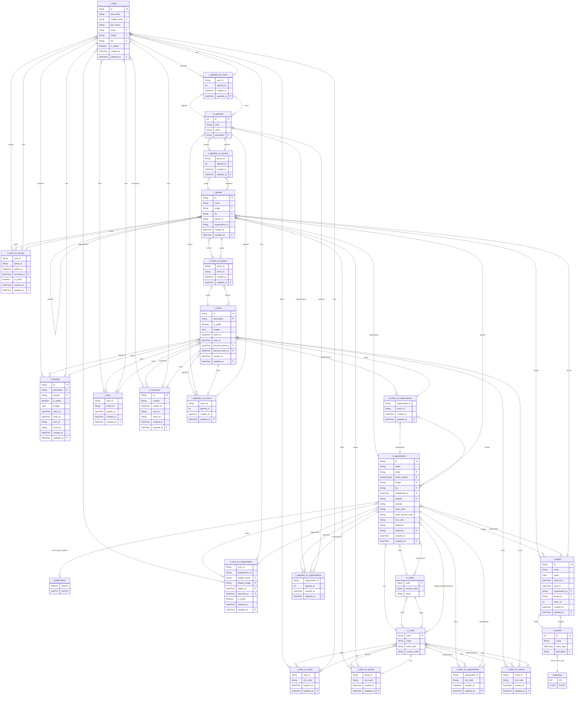

```mermaid
erDiagram

        EntityPosition {
            PREFIX PREFIX
SUFFIX SUFFIX
        }
    


        ValueType {
            INT INT
FLOAT FLOAT
        }
    
  "t_users" {
    String id "🗝️"
    String last_name 
    String middle_name "❓"
    String first_name 
    String email "❓"
    String image "❓"
    String bio "❓"
    Boolean is_public 
    DateTime created_at 
    DateTime updated_at "❓"
    }
  

  "t_groups" {
    String id "🗝️"
    String name 
    String image "❓"
    String bio "❓"
    String parent_id "❓"
    String organization_id 
    DateTime created_at 
    DateTime updated_at "❓"
    }
  

  "t_users_on_groups" {
    String user_id 
    String group_id 
    DateTime added_at "❓"
    DateTime removed_at "❓"
    Boolean is_public 
    DateTime created_at 
    DateTime updated_at "❓"
    }
  

  "t_organizations" {
    String id "🗝️"
    String name 
    String entity "❓"
    EntityPosition entity_position "❓"
    String image "❓"
    String bio "❓"
    DateTime established_at "❓"
    String website "❓"
    String zipcode 
    String state_code 
    String state_country_code 
    String city_code 
    String address1 
    String address2 "❓"
    DateTime created_at 
    DateTime updated_at "❓"
    }
  

  "t_users_on_organizations" {
    String user_id 
    String organization_id 
    String display_name "❓"
    String display_image "❓"
    DateTime added_at "❓"
    DateTime removed_at "❓"
    Boolean is_public 
    DateTime created_at 
    DateTime updated_at "❓"
    }
  

  "t_activities" {
    String id "🗝️"
    String description "❓"
    String remark "❓"
    Boolean is_public 
    Json images 
    DateTime starts_at 
    DateTime ends_at 
    String user_id 
    String event_id 
    DateTime created_at 
    DateTime updated_at "❓"
    }
  

  "t_events" {
    String id "🗝️"
    String description "❓"
    Boolean is_public 
    Json images 
    DateTime starts_at 
    DateTime ends_at 
    DateTime planned_starts_at "❓"
    DateTime planned_ends_at "❓"
    DateTime created_at 
    DateTime updated_at "❓"
    }
  

  "t_events_on_groups" {
    String group_id 
    String event_id 
    DateTime created_at 
    DateTime updated_at "❓"
    }
  

  "t_events_on_organizations" {
    String organization_id 
    String event_id 
    DateTime created_at 
    DateTime updated_at "❓"
    }
  

  "t_likes" {
    String user_id 
    String event_id 
    DateTime posted_at 
    DateTime created_at 
    DateTime updated_at "❓"
    }
  

  "t_comments" {
    String id "🗝️"
    String content 
    DateTime posted_at 
    String user_id 
    String event_id 
    DateTime created_at 
    DateTime updated_at "❓"
    }
  

  "t_targets" {
    String id "🗝️"
    String name 
    Float value 
    DateTime valid_from 
    DateTime valid_to 
    String organization_id "❓"
    String group_id "❓"
    Int index_id 
    DateTime created_at 
    DateTime updated_at "❓"
    }
  

  "m_agendas" {
    Int id "🗝️"
    String code 
    String name 
    String description "❓"
    }
  

  "t_agendas_on_users" {
    String user_id 
    Int agenda_id 
    DateTime created_at 
    DateTime updated_at "❓"
    }
  

  "t_agendas_on_groups" {
    String group_id 
    Int agenda_id 
    DateTime created_at 
    DateTime updated_at "❓"
    }
  

  "t_agendas_on_organizations" {
    String organization_id 
    Int agenda_id 
    DateTime created_at 
    DateTime updated_at "❓"
    }
  

  "t_agendas_on_events" {
    String event_id 
    Int agenda_id 
    DateTime created_at 
    DateTime updated_at "❓"
    }
  

  "m_cities" {
    String code "🗝️"
    String name 
    String state_code 
    String country_code 
    }
  

  "m_states" {
    String code "🗝️"
    String country_code 
    String name 
    }
  

  "t_cities_on_users" {
    String user_id 
    String city_code 
    DateTime created_at 
    DateTime updated_at "❓"
    }
  

  "t_cities_on_groups" {
    String group_id 
    String city_code 
    DateTime created_at 
    DateTime updated_at "❓"
    }
  

  "t_cities_on_organizations" {
    String organization_id 
    String city_code 
    DateTime created_at 
    DateTime updated_at "❓"
    }
  

  "t_cities_on_events" {
    String event_id 
    String city_code 
    DateTime created_at 
    DateTime updated_at "❓"
    }
  

  "t_indexes" {
    Int id "🗝️"
    String name 
    ValueType value_type 
    String description "❓"
    }
  
    "t_users" o{--}o "t_agendas_on_users" : "agendas"
    "t_users" o{--}o "t_cities_on_users" : "cities"
    "t_users" o{--}o "t_users_on_groups" : "groups"
    "t_users" o{--}o "t_users_on_organizations" : "organizations"
    "t_users" o{--}o "t_activities" : "activities"
    "t_users" o{--}o "t_likes" : "likes"
    "t_users" o{--}o "t_comments" : "comments"
    "t_groups" o{--}o "t_users_on_groups" : "users"
    "t_groups" o{--}o "t_events_on_groups" : "events"
    "t_groups" o{--}o "t_agendas_on_groups" : "agendas"
    "t_groups" o{--}o "t_cities_on_groups" : "cities"
    "t_groups" o{--}o "t_targets" : "targets"
    "t_groups" o|--|o "t_groups" : "parent"
    "t_groups" o{--}o "t_groups" : "children"
    "t_groups" o|--|| "t_organizations" : "organization"
    "t_users_on_groups" o|--|| "t_users" : "user"
    "t_users_on_groups" o|--|| "t_groups" : "group"
    "t_organizations" o|--|o "EntityPosition" : "enum:entity_position"
    "t_organizations" o|--|| "m_states" : "state"
    "t_organizations" o|--|| "m_cities" : "city"
    "t_organizations" o{--}o "t_groups" : "groups"
    "t_organizations" o{--}o "t_users_on_organizations" : "users"
    "t_organizations" o{--}o "t_events_on_organizations" : "events"
    "t_organizations" o{--}o "t_agendas_on_organizations" : "agendas"
    "t_organizations" o{--}o "t_cities_on_organizations" : "cities"
    "t_organizations" o{--}o "t_targets" : "targets"
    "t_users_on_organizations" o|--|| "t_users" : "user"
    "t_users_on_organizations" o|--|| "t_organizations" : "organization"
    "t_activities" o|--|| "t_users" : "user"
    "t_activities" o|--|| "t_events" : "event"
    "t_events" o{--}o "t_agendas_on_events" : "agendas"
    "t_events" o{--}o "t_events_on_groups" : "groups"
    "t_events" o{--}o "t_events_on_organizations" : "organizations"
    "t_events" o{--}o "t_likes" : "likes"
    "t_events" o{--}o "t_comments" : "comments"
    "t_events" o{--}o "t_activities" : "activities"
    "t_events" o{--}o "t_cities_on_events" : "cities"
    "t_events_on_groups" o|--|| "t_groups" : "group"
    "t_events_on_groups" o|--|| "t_events" : "event"
    "t_events_on_organizations" o|--|| "t_organizations" : "organization"
    "t_events_on_organizations" o|--|| "t_events" : "event"
    "t_likes" o|--|| "t_users" : "user"
    "t_likes" o|--|| "t_events" : "event"
    "t_comments" o|--|| "t_users" : "user"
    "t_comments" o|--|| "t_events" : "event"
    "t_targets" o|--|o "t_organizations" : "organization"
    "t_targets" o|--|o "t_groups" : "group"
    "t_targets" o|--|| "t_indexes" : "index"
    "m_agendas" o{--}o "t_agendas_on_users" : "users"
    "m_agendas" o{--}o "t_agendas_on_groups" : "groups"
    "m_agendas" o{--}o "t_agendas_on_organizations" : "organizations"
    "m_agendas" o{--}o "t_agendas_on_events" : "events"
    "t_agendas_on_users" o|--|| "t_users" : "user"
    "t_agendas_on_users" o|--|| "m_agendas" : "agenda"
    "t_agendas_on_groups" o|--|| "t_groups" : "group"
    "t_agendas_on_groups" o|--|| "m_agendas" : "agenda"
    "t_agendas_on_organizations" o|--|| "t_organizations" : "organization"
    "t_agendas_on_organizations" o|--|| "m_agendas" : "agenda"
    "t_agendas_on_events" o|--|| "t_events" : "event"
    "t_agendas_on_events" o|--|| "m_agendas" : "agenda"
    "m_cities" o|--|| "m_states" : "state"
    "m_cities" o{--}o "t_cities_on_users" : "cities"
    "m_cities" o{--}o "t_cities_on_groups" : "groups"
    "m_cities" o{--}o "t_cities_on_organizations" : "organizations"
    "m_cities" o{--}o "t_organizations" : "addressedOrganizations"
    "m_cities" o{--}o "t_cities_on_events" : "citiesOnEvents"
    "m_states" o{--}o "m_cities" : "cities"
    "m_states" o{--}o "t_organizations" : "organization"
    "t_cities_on_users" o|--|| "t_users" : "user"
    "t_cities_on_users" o|--|| "m_cities" : "city"
    "t_cities_on_groups" o|--|| "t_groups" : "group"
    "t_cities_on_groups" o|--|| "m_cities" : "city"
    "t_cities_on_organizations" o|--|| "t_organizations" : "organization"
    "t_cities_on_organizations" o|--|| "m_cities" : "city"
    "t_cities_on_events" o|--|| "t_events" : "event"
    "t_cities_on_events" o|--|| "m_cities" : "city"
    "t_indexes" o|--|| "ValueType" : "enum:value_type"
    "t_indexes" o{--}o "t_targets" : "targets"
```
