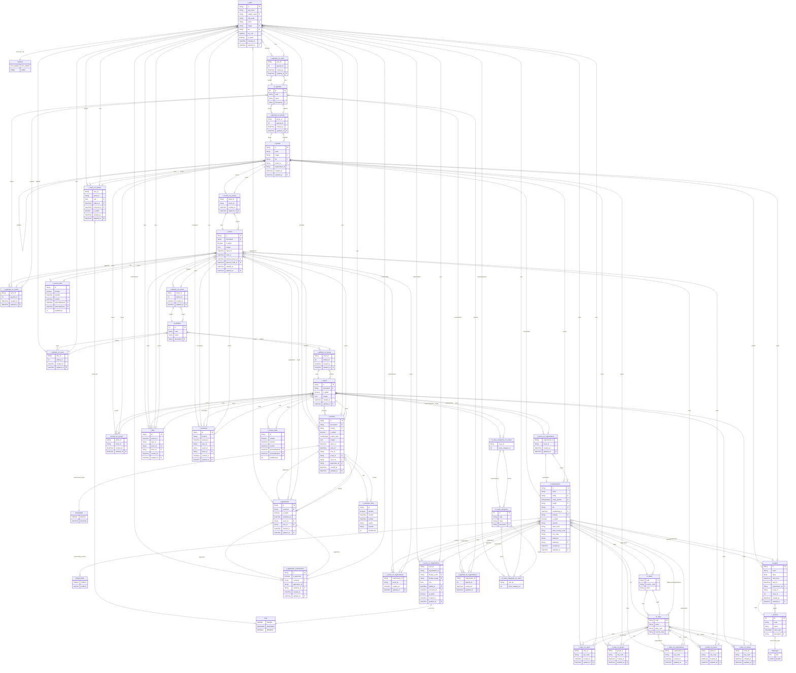

```mermaid
erDiagram

        SysRole {
            SYS_ADMIN SYS_ADMIN
USER USER
        }
    


        Role {
            OWNER OWNER
MANAGER MANAGER
MEMBER MEMBER
        }
    


        EntityPosition {
            PREFIX PREFIX
SUFFIX SUFFIX
        }
    


        ValueType {
            INT INT
FLOAT FLOAT
        }
    


        ActivityStyle {
            ONSITE ONSITE
OFFSITE OFFSITE
        }
    
  "t_users" {
    String id "🗝️"
    String last_name 
    String middle_name "❓"
    String first_name 
    String email "❓"
    String image "❓"
    String bio "❓"
    SysRole sys_role 
    Boolean is_public 
    DateTime created_at 
    DateTime updated_at "❓"
    }
  

  "t_groups" {
    String id "🗝️"
    String name 
    String image "❓"
    String bio "❓"
    String parent_id "❓"
    String organization_id 
    DateTime created_at 
    DateTime updated_at "❓"
    }
  

  "t_users_on_groups" {
    String user_id 
    String group_id 
    Role role "❓"
    DateTime added_at "❓"
    DateTime removed_at "❓"
    Boolean is_public 
    DateTime created_at 
    DateTime updated_at "❓"
    }
  

  "t_organizations" {
    String id "🗝️"
    String name 
    String entity "❓"
    EntityPosition entity_position "❓"
    String image "❓"
    String bio "❓"
    DateTime established_at "❓"
    String website "❓"
    Boolean is_public 
    String zipcode 
    String state_code 
    String state_country_code 
    String city_code 
    String address1 
    String address2 "❓"
    DateTime created_at 
    DateTime updated_at "❓"
    }
  

  "t_users_on_organizations" {
    String user_id 
    String organization_id 
    String display_name "❓"
    String display_image "❓"
    Role role 
    DateTime added_at "❓"
    DateTime removed_at "❓"
    Boolean is_public 
    DateTime created_at 
    DateTime updated_at "❓"
    }
  

  "t_activities" {
    String id "🗝️"
    String description "❓"
    String remark "❓"
    Boolean is_public 
    ActivityStyle activity_style 
    Json images 
    DateTime starts_at 
    DateTime ends_at 
    String user_id 
    String event_id "❓"
    String issue_id "❓"
    String application_id "❓"
    DateTime created_at 
    DateTime updated_at "❓"
    }
  

  "t_applications" {
    String id "🗝️"
    String comment "❓"
    Boolean is_public 
    DateTime submitted_at 
    String event_id "❓"
    String user_id "❓"
    DateTime created_at 
    DateTime updated_at "❓"
    }
  

  "t_application_confirmations" {
    String id "🗝️"
    Boolean is_approved 
    String comment "❓"
    String application_id 
    String confirmer_id "❓"
    DateTime created_at 
    DateTime updated_at "❓"
    }
  

  "t_events" {
    String id "🗝️"
    String description "❓"
    Boolean is_public 
    Json images 
    DateTime starts_at 
    DateTime ends_at 
    DateTime planned_starts_at "❓"
    DateTime planned_ends_at "❓"
    DateTime created_at 
    DateTime updated_at "❓"
    }
  

  "t_events_on_groups" {
    String group_id 
    String event_id 
    DateTime created_at 
    DateTime updated_at "❓"
    }
  

  "t_events_on_organizations" {
    String organization_id 
    String event_id 
    DateTime created_at 
    DateTime updated_at "❓"
    }
  

  "t_issues" {
    String id "🗝️"
    String description "❓"
    Boolean is_public 
    Json images 
    DateTime created_at 
    DateTime updated_at "❓"
    }
  

  "t_issues_on_groups" {
    String group_id 
    String issue_id 
    DateTime created_at 
    DateTime updated_at "❓"
    }
  

  "t_issues_on_organizations" {
    String organization_id 
    String issue_id 
    DateTime created_at 
    DateTime updated_at "❓"
    }
  

  "t_likes" {
    String id "🗝️"
    DateTime posted_at 
    String user_id 
    String event_id "❓"
    String issue_id "❓"
    DateTime created_at 
    DateTime updated_at "❓"
    }
  

  "t_comments" {
    String id "🗝️"
    String content 
    DateTime posted_at 
    String user_id 
    String event_id "❓"
    String issue_id "❓"
    DateTime created_at 
    DateTime updated_at "❓"
    }
  

  "t_targets" {
    String id "🗝️"
    String name 
    Float value 
    DateTime valid_from 
    DateTime valid_to 
    String organization_id "❓"
    String group_id "❓"
    Int index_id 
    DateTime created_at 
    DateTime updated_at "❓"
    }
  

  "m_agendas" {
    Int id "🗝️"
    String code 
    String name 
    String description "❓"
    }
  

  "t_agendas_on_users" {
    String user_id 
    Int agenda_id 
    DateTime created_at 
    DateTime updated_at "❓"
    }
  

  "t_agendas_on_groups" {
    String group_id 
    Int agenda_id 
    DateTime created_at 
    DateTime updated_at "❓"
    }
  

  "t_agendas_on_organizations" {
    String organization_id 
    Int agenda_id 
    DateTime created_at 
    DateTime updated_at "❓"
    }
  

  "t_agendas_on_events" {
    String event_id 
    Int agenda_id 
    DateTime created_at 
    DateTime updated_at "❓"
    }
  

  "m_issue_categories" {
    Int id "🗝️"
    String code 
    String name 
    String description "❓"
    }
  

  "m_issue_categories_on_issues" {
    String issue_id 
    Int issue_category_id 
    }
  

  "m_issue_categories_on_users" {
    String user_id 
    Int issue_category_id 
    }
  

  "m_skillsets" {
    Int id "🗝️"
    String code 
    String name 
    String description "❓"
    }
  

  "t_skillsets_on_users" {
    String user_id 
    Int skillset_id 
    DateTime created_at 
    DateTime updated_at "❓"
    }
  

  "t_skillsets_on_events" {
    String event_id 
    Int skillset_id 
    DateTime created_at 
    DateTime updated_at "❓"
    }
  

  "t_skillsets_on_issues" {
    String issue_id 
    Int skillset_id 
    DateTime created_at 
    DateTime updated_at "❓"
    }
  

  "m_cities" {
    String code "🗝️"
    String name 
    String state_code 
    String country_code 
    }
  

  "m_states" {
    String code "🗝️"
    String country_code 
    String name 
    }
  

  "t_cities_on_users" {
    String user_id 
    String city_code 
    DateTime created_at 
    DateTime updated_at "❓"
    }
  

  "t_cities_on_groups" {
    String group_id 
    String city_code 
    DateTime created_at 
    DateTime updated_at "❓"
    }
  

  "t_cities_on_organizations" {
    String organization_id 
    String city_code 
    DateTime created_at 
    DateTime updated_at "❓"
    }
  

  "t_cities_on_events" {
    String event_id 
    String city_code 
    DateTime created_at 
    DateTime updated_at "❓"
    }
  

  "t_cities_on_issues" {
    String issue_id 
    String city_code 
    DateTime created_at 
    DateTime updated_at "❓"
    }
  

  "t_indexes" {
    Int id "🗝️"
    String code 
    String name 
    ValueType value_type 
    String description "❓"
    }
  

  "v_activities_stats" {
    String id 
    Boolean isPublic 
    DateTime startsAt 
    DateTime endsAt 
    String userId 
    String eventId 
    Int totalMinutes 
    }
  

  "v_events_stats" {
    String id 
    Boolean isPublic 
    DateTime startsAt 
    DateTime endsAt 
    DateTime plannedStartsAt "❓"
    DateTime plannedEndsAt "❓"
    Int totalMinutes 
    }
  

  "v_issues_stats" {
    String id 
    Boolean isPublic 
    DateTime startsAt 
    DateTime endsAt 
    DateTime plannedStartsAt "❓"
    DateTime plannedEndsAt "❓"
    Int totalMinutes 
    }
  
    "t_users" o|--|| "SysRole" : "enum:sys_role"
    "t_users" o{--}o "t_agendas_on_users" : "agendas"
    "t_users" o{--}o "t_skillsets_on_users" : "skillsets"
    "t_users" o{--}o "m_issue_categories_on_users" : "issueCategories"
    "t_users" o{--}o "t_cities_on_users" : "cities"
    "t_users" o{--}o "t_users_on_groups" : "groups"
    "t_users" o{--}o "t_users_on_organizations" : "organizations"
    "t_users" o{--}o "t_applications" : "applications"
    "t_users" o{--}o "t_application_confirmations" : "confirmations"
    "t_users" o{--}o "t_activities" : "activities"
    "t_users" o{--}o "t_likes" : "likes"
    "t_users" o{--}o "t_comments" : "comments"
    "t_groups" o{--}o "t_users_on_groups" : "users"
    "t_groups" o{--}o "t_events_on_groups" : "events"
    "t_groups" o{--}o "t_issues_on_groups" : "issues"
    "t_groups" o{--}o "t_agendas_on_groups" : "agendas"
    "t_groups" o{--}o "t_cities_on_groups" : "cities"
    "t_groups" o{--}o "t_targets" : "targets"
    "t_groups" o|--|o "t_groups" : "parent"
    "t_groups" o{--}o "t_groups" : "children"
    "t_groups" o|--|| "t_organizations" : "organization"
    "t_users_on_groups" o|--|| "t_users" : "user"
    "t_users_on_groups" o|--|| "t_groups" : "group"
    "t_users_on_groups" o|--|o "Role" : "enum:role"
    "t_organizations" o|--|o "EntityPosition" : "enum:entity_position"
    "t_organizations" o|--|| "m_states" : "state"
    "t_organizations" o|--|| "m_cities" : "city"
    "t_organizations" o{--}o "t_groups" : "groups"
    "t_organizations" o{--}o "t_users_on_organizations" : "users"
    "t_organizations" o{--}o "t_events_on_organizations" : "events"
    "t_organizations" o{--}o "t_issues_on_organizations" : "issues"
    "t_organizations" o{--}o "t_agendas_on_organizations" : "agendas"
    "t_organizations" o{--}o "t_cities_on_organizations" : "cities"
    "t_organizations" o{--}o "t_targets" : "targets"
    "t_users_on_organizations" o|--|| "t_users" : "user"
    "t_users_on_organizations" o|--|| "t_organizations" : "organization"
    "t_users_on_organizations" o|--|| "Role" : "enum:role"
    "t_activities" o|--|| "ActivityStyle" : "enum:activity_style"
    "t_activities" o|--|| "t_users" : "user"
    "t_activities" o|--|o "t_events" : "event"
    "t_activities" o|--|o "t_issues" : "issue"
    "t_activities" o|--|o "t_applications" : "application"
    "t_activities" o{--}o "v_activities_stats" : "stat"
    "t_applications" o|--|o "t_events" : "event"
    "t_applications" o|--|o "t_users" : "user"
    "t_applications" o{--}o "t_activities" : "activity"
    "t_applications" o{--}o "t_application_confirmations" : "approvals"
    "t_application_confirmations" o|--|| "t_applications" : "application"
    "t_application_confirmations" o|--|o "t_users" : "confirmedBy"
    "t_events" o{--}o "t_agendas_on_events" : "agendas"
    "t_events" o{--}o "t_skillsets_on_events" : "skillsets"
    "t_events" o{--}o "t_events_on_groups" : "groups"
    "t_events" o{--}o "t_events_on_organizations" : "organizations"
    "t_events" o{--}o "t_applications" : "applications"
    "t_events" o{--}o "t_likes" : "likes"
    "t_events" o{--}o "t_comments" : "comments"
    "t_events" o{--}o "t_activities" : "activities"
    "t_events" o{--}o "t_cities_on_events" : "cities"
    "t_events" o{--}o "v_events_stats" : "stat"
    "t_events_on_groups" o|--|| "t_groups" : "group"
    "t_events_on_groups" o|--|| "t_events" : "event"
    "t_events_on_organizations" o|--|| "t_organizations" : "organization"
    "t_events_on_organizations" o|--|| "t_events" : "event"
    "t_issues" o{--}o "t_skillsets_on_issues" : "skillsets"
    "t_issues" o{--}o "m_issue_categories_on_issues" : "issueCategories"
    "t_issues" o{--}o "t_issues_on_groups" : "groups"
    "t_issues" o{--}o "t_issues_on_organizations" : "organizations"
    "t_issues" o{--}o "t_likes" : "likes"
    "t_issues" o{--}o "t_comments" : "comments"
    "t_issues" o{--}o "t_activities" : "activities"
    "t_issues" o{--}o "t_cities_on_issues" : "cities"
    "t_issues" o{--}o "v_issues_stats" : "stat"
    "t_issues_on_groups" o|--|| "t_groups" : "group"
    "t_issues_on_groups" o|--|| "t_issues" : "issue"
    "t_issues_on_organizations" o|--|| "t_organizations" : "organization"
    "t_issues_on_organizations" o|--|| "t_issues" : "issue"
    "t_likes" o|--|| "t_users" : "user"
    "t_likes" o|--|o "t_events" : "event"
    "t_likes" o|--|o "t_issues" : "issue"
    "t_comments" o|--|| "t_users" : "user"
    "t_comments" o|--|o "t_events" : "event"
    "t_comments" o|--|o "t_issues" : "issue"
    "t_targets" o|--|o "t_organizations" : "organization"
    "t_targets" o|--|o "t_groups" : "group"
    "t_targets" o|--|| "t_indexes" : "index"
    "m_agendas" o{--}o "t_agendas_on_users" : "users"
    "m_agendas" o{--}o "t_agendas_on_groups" : "groups"
    "m_agendas" o{--}o "t_agendas_on_organizations" : "organizations"
    "m_agendas" o{--}o "t_agendas_on_events" : "events"
    "t_agendas_on_users" o|--|| "t_users" : "user"
    "t_agendas_on_users" o|--|| "m_agendas" : "agenda"
    "t_agendas_on_groups" o|--|| "t_groups" : "group"
    "t_agendas_on_groups" o|--|| "m_agendas" : "agenda"
    "t_agendas_on_organizations" o|--|| "t_organizations" : "organization"
    "t_agendas_on_organizations" o|--|| "m_agendas" : "agenda"
    "t_agendas_on_events" o|--|| "t_events" : "event"
    "t_agendas_on_events" o|--|| "m_agendas" : "agenda"
    "m_issue_categories" o{--}o "m_issue_categories_on_issues" : "issues"
    "m_issue_categories" o{--}o "m_issue_categories_on_users" : "users"
    "m_issue_categories_on_issues" o|--|| "t_issues" : "issue"
    "m_issue_categories_on_issues" o|--|| "m_issue_categories" : "issueCategory"
    "m_issue_categories_on_users" o|--|| "t_users" : "user"
    "m_issue_categories_on_users" o|--|| "m_issue_categories" : "issueCategory"
    "m_skillsets" o{--}o "t_skillsets_on_users" : "users"
    "m_skillsets" o{--}o "t_skillsets_on_events" : "events"
    "m_skillsets" o{--}o "t_skillsets_on_issues" : "issues"
    "t_skillsets_on_users" o|--|| "t_users" : "user"
    "t_skillsets_on_users" o|--|| "m_skillsets" : "skillset"
    "t_skillsets_on_events" o|--|| "t_events" : "event"
    "t_skillsets_on_events" o|--|| "m_skillsets" : "skillset"
    "t_skillsets_on_issues" o|--|| "t_issues" : "issue"
    "t_skillsets_on_issues" o|--|| "m_skillsets" : "skillset"
    "m_cities" o|--|| "m_states" : "state"
    "m_cities" o{--}o "t_cities_on_users" : "cities"
    "m_cities" o{--}o "t_cities_on_groups" : "groups"
    "m_cities" o{--}o "t_cities_on_organizations" : "organizations"
    "m_cities" o{--}o "t_organizations" : "addressedOrganizations"
    "m_cities" o{--}o "t_cities_on_events" : "events"
    "m_cities" o{--}o "t_cities_on_issues" : "issues"
    "m_states" o{--}o "m_cities" : "cities"
    "m_states" o{--}o "t_organizations" : "organization"
    "t_cities_on_users" o|--|| "t_users" : "user"
    "t_cities_on_users" o|--|| "m_cities" : "city"
    "t_cities_on_groups" o|--|| "t_groups" : "group"
    "t_cities_on_groups" o|--|| "m_cities" : "city"
    "t_cities_on_organizations" o|--|| "t_organizations" : "organization"
    "t_cities_on_organizations" o|--|| "m_cities" : "city"
    "t_cities_on_events" o|--|| "t_events" : "event"
    "t_cities_on_events" o|--|| "m_cities" : "city"
    "t_cities_on_issues" o|--|| "t_issues" : "issue"
    "t_cities_on_issues" o|--|| "m_cities" : "city"
    "t_indexes" o|--|| "ValueType" : "enum:value_type"
    "t_indexes" o{--}o "t_targets" : "targets"
    "v_activities_stats" o|--|| "t_activities" : "activity"
    "v_events_stats" o|--|| "t_events" : "event"
    "v_issues_stats" o|--|| "t_issues" : "issue"
```
