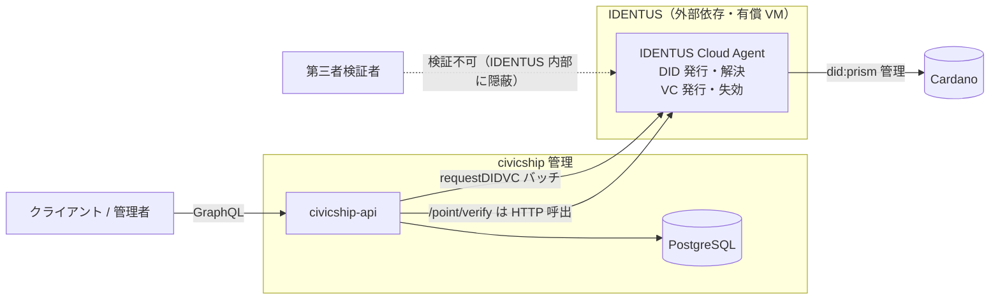
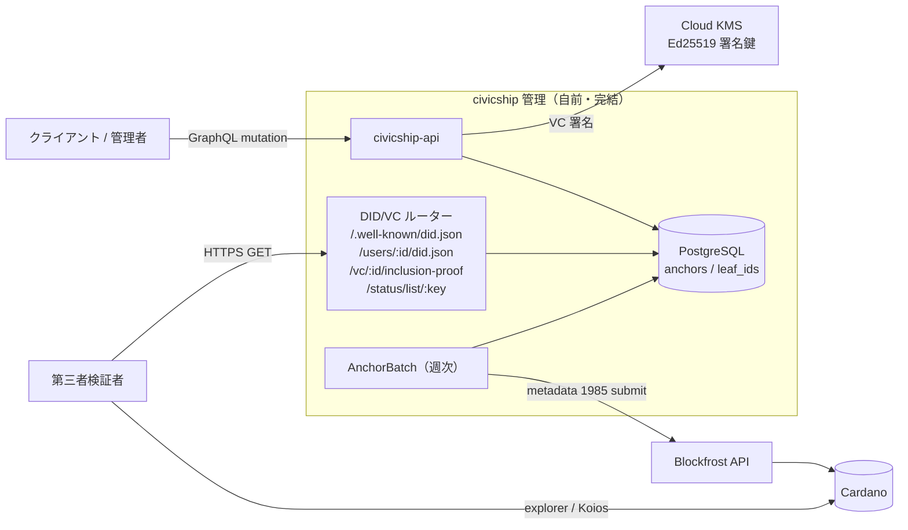
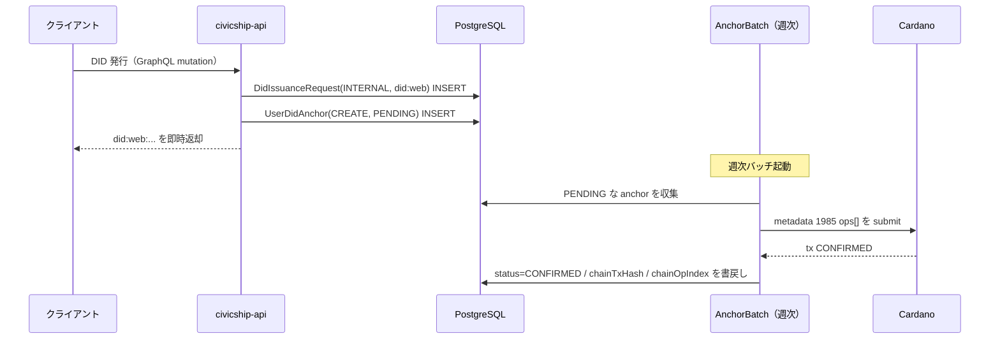
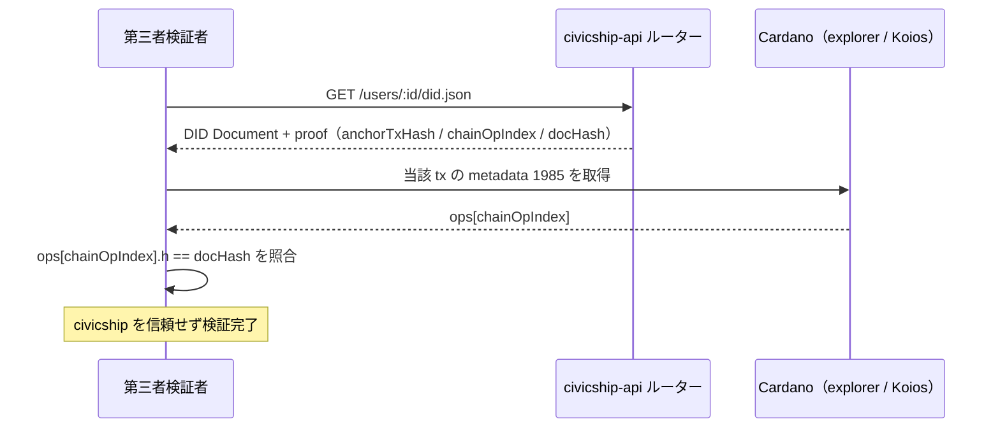

# DID/VC アーキテクチャ移行 — 機能パリティ説明書

IDENTUS を前提とした旧アーキテクチャから、内製アーキテクチャへの移行が
**「機能的に差分ゼロ」** であることを、図と表で示すドキュメント。

> **このドキュメントの位置づけ**
> 変わったのは *実装* だけで、ユーザー / 連携先 / 第三者から見た *機能* は
> 等価である。むしろ「第三者検証可能性」と「運用コスト」では旧方式を上回る。
> 設計の正本は [`did-vc-internalization.md`](./did-vc-internalization.md)
> （~2,400 行）であり、本書はその「移行が等価であること」を一望するための
> 要約図解である。

---

## 0. 移行のゴール

> 既存の **IDENTUS ありき** のアーキテクチャと、**内製化後** のアーキテクチャの
> 間に、**機能的な差分が無い** こと。

「差分が無い」の定義は次の 3 点に分解できる:

1. **対外的な振る舞いが同じ** — GraphQL schema、`/point/verify` のレスポンス形、
   DID/VC の発行・失効・検証という機能セットが維持される。
2. **データの意味が同じ** — DID 操作履歴・Transaction の Merkle anchor が
   引き続き Cardano 上に記録され、追跡可能性を失わない（VC の Merkle anchor
   のみ §3.2 の注記のとおり Phase 2 持ち越し）。
3. **破壊的変更ゼロ** — 既存テーブル・enum・API を壊さない。

以降、この 3 点が満たされていることを図・表で確認する。ただし DID 解決の
*トラストモデル* には本質的な差分が 1 点あり（`did:web` のドメイン依存）、
§5 でそれも過大主張せず正直に扱う。

---

## 1. アーキテクチャ図 — Before / After

### 1.1 旧: IDENTUS 前提アーキテクチャ

**特徴**: DID・VC・失効・Cardano 書込の中核が外部 IDENTUS に存在し、
civicship からは不透明。第三者は IDENTUS を信頼するしか検証手段が無い。

### 1.2 新: 内製アーキテクチャ

**特徴**: DID・VC・失効・Cardano 書込のすべてが civicship 内に閉じる。
外部依存は「汎用 Cardano ノード API（Blockfrost）」と「鍵保管庫（KMS）」のみで、
いずれも IDENTUS のようなドメイン固有のブラックボックスではない。

---

## 2. コンポーネント対応表（1:1 マッピング）

旧アーキテクチャの各機能は、新アーキテクチャの具体的な実装に **過不足なく**
対応する。「消えた機能」も「代替の無い欠落」も無い。

| 機能領域 | 旧（IDENTUS） | 新（内製） | 等価性 |
|---|---|---|:---:|
| DID 方式 | `did:prism:<不透明文字列>` | `did:web:api.civicship.app:users:<cuid>` | ✅ |
| DID 発行トリガ | `requestDIDVC` バッチ → IDENTUS 非同期ジョブ | GraphQL mutation（同期）/ backfill スクリプト | ✅ |
| DID Document 配信 | IDENTUS Cloud Agent | civicship-api Express ルーター | ✅ |
| DID 操作履歴 | PRISM 内部管理 | Cardano metadata 1985 `ops[]` | ✅ |
| VC フォーマット | `IDENTUS_VC_PRISM`（IDENTUS 専用 JWT） | `INTERNAL_JWT`（W3C VC JWT） | ✅ |
| VC 署名鍵 | IDENTUS 管理鍵 | Cloud KMS Ed25519 | ✅ |
| VC 失効 | IDENTUS revocation list | W3C Bitstring Status List 2021 | ✅ |
| Transaction の Merkle anchor | civicship が計算 → IDENTUS が書込 | civicship が Blockfrost 経由で直接 Cardano に書込 | ✅ |
| VC の Merkle anchor | civicship が計算 → IDENTUS が書込 | 配線は Phase 2 持ち越し（§3.2 注記） | ⚠️ |
| `/point/verify` | IDENTUS API への HTTP 呼出 | ローカル DB（`t_transaction_anchors.leaf_ids` GIN index）参照 | ✅ |
| 第三者検証 | 不可能（IDENTUS 内部に隠蔽） | Cardano explorer + HTTPS GET で完結 | ✅ 向上 |
| 運用コスト | IDENTUS VM（月額 $数十） | Blockfrost + KMS（月額 ~$1） | ✅ 向上 |
| GraphQL schema | `DidIssuanceRequest` / `VcIssuanceRequest` | 同 shape を維持（enum で内製/legacy 区別） | ✅ |

---

## 3. 主要フロー別 — Before / After

### 3.1 DID 発行とアンカリング

| | 旧（IDENTUS） | 新（内製） |
|---|---|---|
| 発行 | `requestDIDVC` バッチが IDENTUS に非同期依頼 | GraphQL mutation で `DidIssuanceRequest(INTERNAL)` + `UserDidAnchor(PENDING)` を即時 INSERT |
| chain 記録 | IDENTUS が `did:prism` 操作を Cardano に記録 | 週次 `AnchorBatch` が `UserDidAnchor` を metadata 1985 `ops[]` として submit |
| 結果 | DID 操作が Cardano 上に存在 | DID 操作が Cardano 上に存在（**同じ**） |

新フローのシーケンス:

### 3.2 VC 発行・失効

| | 旧（IDENTUS） | 新（内製） |
|---|---|---|
| 発行 | IDENTUS が VC（`IDENTUS_VC_PRISM`）を発行 | `VcIssuanceService.issueVc` → `KmsJwtSigner` が W3C VC JWT を署名 |
| 署名鍵 | IDENTUS 管理鍵 | Cloud KMS Ed25519（civicship が鍵リング所有） |
| 失効 | IDENTUS revocation list | W3C Bitstring Status List 2021（`/status/list/:key` で配信） |
| 結果 | 標準的な検証可能クレデンシャル | 標準的な検証可能クレデンシャル（**W3C 準拠でより標準的**） |

> **注（VC の Cardano anchor）**: VC を Cardano に Merkle anchor する配線
> （`VcAnchor` 行の生成 → 週次バッチへの供給）は **未実装で Phase 2 持ち越し**。
> 現時点で VC anchor を要するユースケースが無いため、ユースケース再来時に
> 対応する。したがって `/vc/:id/inclusion-proof` は現状機能しない。VC の
> 発行・署名（KMS）・失効（StatusList）は実装済で動作する。

### 3.3 第三者検証

ここが最も「機能向上」した領域。旧方式では検証は不可能だったが、新方式では
civicship を信頼せずに検証が完結する。

検証スクリプト [`scripts/verify-from-chain.ts`](../../scripts/verify-from-chain.ts)
が civicship のコードに一切依存せず（Koios + Blake2b のみ）この検証を実演する。

### 3.4 `/point/verify`

| | 旧（IDENTUS） | 新（内製） |
|---|---|---|
| 実装 | IDENTUS API への外部 HTTP 呼出 | ローカル DB `t_transaction_anchors.leaf_ids` への GIN index overlap クエリ |
| レスポンス形 | `{ txId, status, transactionHash, rootHash, label }` | **同一**（変更なし） |
| 外部依存 | あり（IDENTUS 稼働必須） | なし（DB のみ） |

レスポンス形が完全に同一のため、`/point/verify` の呼び出し側から見た差分はゼロ。

---

## 4. 「機能差分ゼロ」の根拠

### 4.1 成功基準（設計書 §1.3）— 7 項目中 6 達成（VC anchor のみ Phase 2）

| # | 基準 | 達成 |
|---|---|:---:|
| 1 | `/point/verify` が外部 HTTP ゼロ・ローカル DB 参照のみで応答 | ✅ |
| 2 | 新規 DID/VC が IDENTUS API を一切呼ばずに発行される | ✅ |
| 3 | 第三者が Cardano explorer + HTTPS GET だけで独立検証できる | ⚠️ DID は達成 / VC は §3.2 注記のとおり Phase 2 |
| 4 | DID 鍵ローテ・deactivate が Cardano 上に追跡可能な履歴として残る | ✅ |
| 5 | 月額運用コスト ≤ $5/月 | ✅（~$1/月） |
| 6 | 既存 GraphQL schema への破壊的変更ゼロ | ✅ |
| 7 | `/point/verify` のレスポンス形を維持 | ✅ |

### 4.2 非ゴール（＝壊していないこと）の維持

| 非ゴール | 維持 |
|---|:---:|
| 既発行 `did:prism:...` を書き換えない（履歴として残置） | ✅ |
| 既存テーブルへの破壊的スキーマ変更なし（全カラム NULL 許容 / default 付き追加） | ✅ |
| `EvaluationCredential` データモデル変更なし | ✅ |
| platform-issued DID を維持（self-sovereign 化しない） | ✅ |

### 4.3 互換性の担保

- GraphQL の `DidIssuanceRequest` / `VcIssuanceRequest` 型・enum は shape を維持。
- legacy enum `IDENTUS_VC_PRISM` は public API breaking change 回避のため残置。
- 旧 `did:prism` 行は削除せず履歴として保持し、新規 `INTERNAL` 行を別途追加。

→ 連携先・既存クライアントは **コード変更なし** で動作し続ける。

> **注**: *機能セット* は等価だが、*トラストモデル* には 1 点だけ構造的な
> 差分がある（`did:web` のドメイン依存）。これは隠さず §5 で明示する。

---

## 5. 唯一の構造的差分 — `did:web` のドメイン依存性

機能の網羅性は等価でも、**DID 解決のトラストモデルには本質的な差分が 1 点ある**。
設計書 §3.3 も「『`did:prism` と同等』という表現は厳密ではない … 機能の網羅性は
同等以上、**トラストモデルは異なる**」と明記している。本書はこの差分を隠さず、
過大主張もせずに整理する。

| | `did:prism`（旧） | `did:web` + Cardano anchor（新） |
|---|---|---|
| 一次解決 | resolver が Cardano chain を直接読む | HTTPS GET（`api.civicship.app`） |
| chain の役割 | 解決の本体 | 補助証拠（改ざん検知・存在証明） |
| 解決の前提 | Cardano + PRISM resolver | **`api.civicship.app` の継続運用** |

→ 本方式は **「HTTPS（`did:web`）を一次解決経路とし、Cardano anchor を補助証拠と
する hybrid 方式」** である。`did:web` の本質的な弱点は **「HTTPS が死ぬと平常時の
DID 解決ができなくなる」** こと。これは隠れた弱点ではなく、平常時の単純さ・標準
ツール互換性と引き換えに設計書 §3.3 で意図的に選んだトレードオフである。

### 5.1 リスク評価

| シナリオ | 確率 | 影響 |
|---|---|---|
| `api.civicship.app` の一時停止 | 低〜中 | DID 解決不能（**一時的** — 復旧で回復） |
| ドメイン失効 | 極低（Cloudflare Registrar 自動更新） | DID の永続的消失 |
| civicship サービス自体の終了 | 中長期リスク | DID 解決経路の喪失（§5.2 の限界つき） |

緩和策（すべて 2026-05 実施済、設計書 §9.6）:

- **ドメイン失効**: Cloudflare Registrar に集約（自動更新 / 更新期間の長期前払い /
  移管ロック / MFA）。
- **DNS / TLS 乗っ取り**: DNSSEC + DS 登録 / CAA / HSTS preload。さらに chain
  anchor の `documentHash` と照合して偽 Document を検出可能。

### 5.2 chain anchor で「再構築できること / できないこと」

設計書 §8.3 に「`api.civicship.app` 消失時に Cardano から再構築する手順」がある。
ただし **実際にできることには明確な限界がある** ので正直に書く。

| 項目 | chain 単独で可能か |
|---|---|
| 「その DID が存在した」事実の証明 | ✅ 可能（metadata 1985 の op 履歴） |
| DID Document の改ざん検知 | ✅ 可能（`documentHash` 照合） |
| 鍵ローテ・deactivate の履歴追跡 | ✅ 可能（`prev` hash chain） |
| **DID Document の内容そのものの復元** | ⚠️ **既存 backfill 分は不可** |

最後の項目が重要:

- DID Document 本体を chain から復元するには、op に `documentCbor`（CBOR 化した
  Document 本体）が含まれている必要がある。
- **prd の Phase 3 backfill で投入した既存 anchor（~1,466 件）は、コスト最適化の
  ため `documentHash` のみを chain に書いており、`documentCbor` を含めていない**
  （設計書 §7.4 / §10.5「doc hash のみの軽量 backfill」方針）。
- したがってこれらの DID は、chain 単独では「存在した事実」と「改ざん検知」までは
  示せるが、**Document の内容（公開鍵など）は復元できない**。内容の保全は DB
  バックアップ等の別手段に依存する。
- なお、運用フェーズの新規発行は `documentCbor` 込みで anchor する設計なので、
  そちらは chain 単独で内容まで復元可能。「再構築可能」の範囲は op の種類で異なる。
- さらに chain からの再構築は **専用ツール**（CSL でのメタデータ展開 + CBOR
  デコード + hash chain 検証）を要し、一般の verifier がすぐ実行できるものではない。

### 5.3 グラント審査での正直な説明方針

> **事実として言ってよいこと**: 「DID/VC 操作を Cardano metadata 1985 に anchor
> しており、**存在証明・改ざん検知・操作履歴の追跡**が第三者に開かれている」。
>
> **言い過ぎになること**: 「Cardano だけで完結する」「civicship が消えても
> Cardano から完全に復元できる」。`did:web` である以上 `api.civicship.app` の
> 継続運用が前提であり、既存 backfill 分は hash-only のため内容復元もできない。
>
> **推奨する説明**: **「HTTPS（`did:web`）を一次解決経路とし、Cardano anchor を
> 改ざん検知・監査の補助証拠とする hybrid 方式」** と正直に位置づける。ドメイン
> 依存は設計書 §3.3 で意図的に選んだトレードオフであり、リスクは §5.1 の緩和策で
> 現実的水準まで下げている、と説明するのが最も安全で誠実。

---

## 6. 差分ゼロを超えて — 内製化で「向上」した点

「機能的に同じ」が目標だったが、副次的に次が改善された:

| 観点 | 改善内容 |
|---|---|
| 第三者検証可能性 | 旧: 不可能 → 新: explorer + HTTPS GET で誰でも独立検証可能 |
| 運用コスト | 旧: 月額 $数十（IDENTUS VM） → 新: 月額 ~$1（Blockfrost + KMS） |
| 標準準拠 | 独自 `did:prism` / IDENTUS JWT → W3C `did:web` / W3C VC JWT / Bitstring Status List 2021 |
| 障害点 | IDENTUS VM という単一障害点を撤去。外部依存は汎用 API のみ |
| 透明性 | DID/VC ロジックが civicship リポジトリ内に可視化（ブラックボックス解消） |

---

## 6. データの正本（source of truth）の移動

機能は等価でも「データがどこに正本として在るか」は移動した。これは
*隠蔽から公開への移動* であり、追跡可能性を強化する方向の変化である。

| データ | 旧の正本 | 新の正本 |
|---|---|---|
| DID Document | IDENTUS 内部 | civicship DB（+ ルーターが動的生成） |
| DID 操作履歴 | PRISM 内部 | `t_user_did_anchors` + Cardano metadata 1985 |
| VC | IDENTUS 内部 | `t_vc_issuance_requests`（Cardano Merkle anchor は Phase 2 持ち越し） |
| 失効状態 | IDENTUS revocation list | `t_status_lists`（+ `/status/list/:key` 配信） |
| Transaction anchor | civicship 計算 → IDENTUS 経由で chain | `t_transaction_anchors` + Cardano（civicship が直接） |

---

## 7. 関連ドキュメント

- 設計の正本: [`did-vc-internalization.md`](./did-vc-internalization.md)
- 移行の完了記録（PR 一覧・実行結果）: [`internalization-completion-2026-05.md`](./internalization-completion-2026-05.md)
- 運用 runbook:
  [`issuer-did-key-rotation.md`](../runbooks/issuer-did-key-rotation.md) /
  [`blockfrost-api-key-rotation.md`](../runbooks/blockfrost-api-key-rotation.md)
- 運用 checklist: [`anchor-batch-deploy-checklist.md`](../operations/anchor-batch-deploy-checklist.md)
- 第三者検証スクリプト: [`scripts/verify-from-chain.ts`](../../scripts/verify-from-chain.ts)
