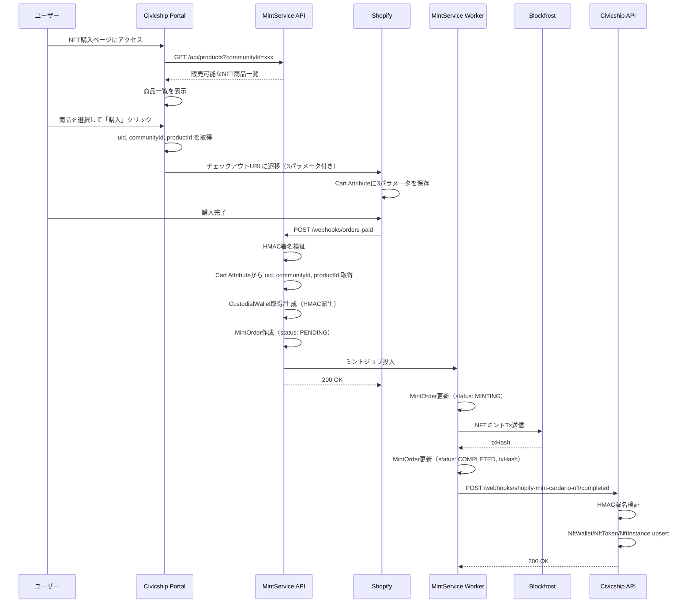
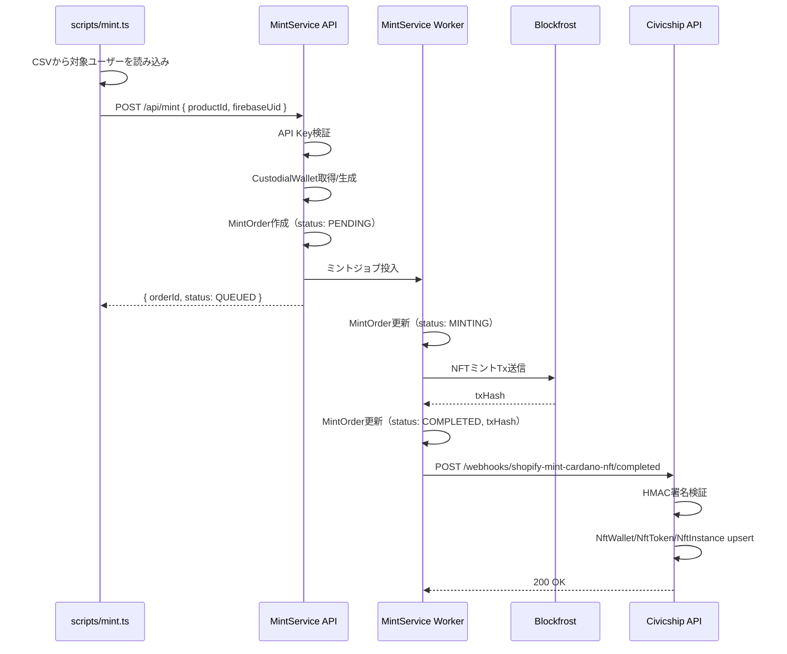
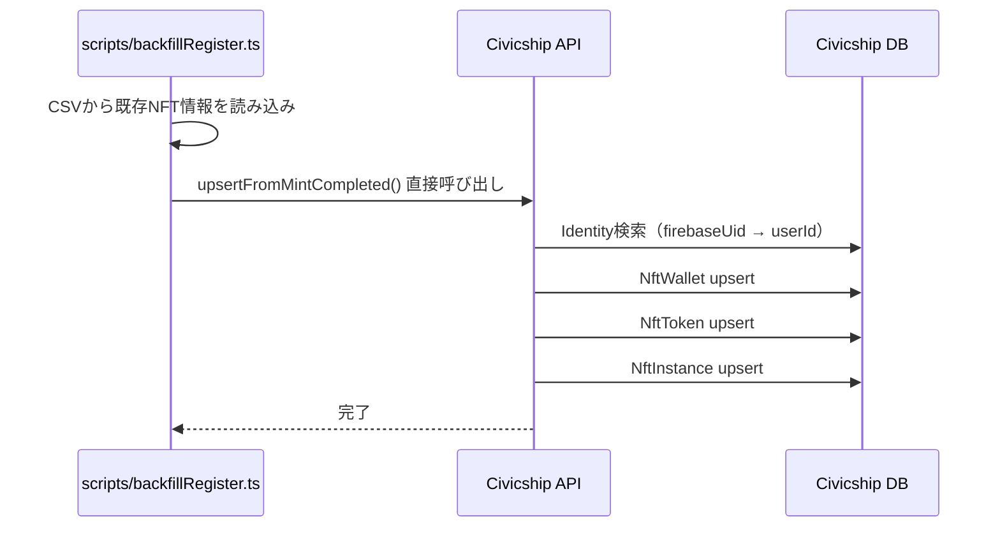

# Shopify Mint Cardano NFT 連携設計書

## 概要

MintService（外部サービス）と連携し、Shopify経由でのCardano NFT購入・発行をCivicshipに統合する。

### 責務分担

| システム | 責務 |
|---------|------|
| MintService | Shopify連携、NFTミント処理、商品管理、Webhook送信 |
| Civicship API | Webhook受信、NFT情報のDB登録 |
| Civicship Portal | NFT商品一覧表示、Shopifyチェックアウトへの遷移 |

---

## Portal → Shopify 遷移要件

### 渡すべき3パラメータ

Portal から Shopify チェックアウトに遷移する際、以下の3つのパラメータを渡す必要がある。

| パラメータ | 説明 | 用途 |
|-----------|------|------|
| `uid` | Firebase UID | MintServiceが「誰のウォレットにミントするか」を判断 |
| `communityId` | コミュニティ識別子 | MintServiceが「どのコミュニティのNFTか」を判定 |
| `productId` | MintService内部のNFT商品ID | MintServiceが「どのNFT商品をミントするか」を決定 |

### Portalの責務

1. MintService API (`GET /api/products?communityId=xxx`) で販売可能なNFT商品一覧を取得
2. 販売中の商品のみを表示
3. ユーザーが商品を選択したら、Shopifyチェックアウトに遷移（3パラメータ付き）
4. **Portalは商品の意味（policyId、metadata等）を解釈しない**

### パラメータ名について

具体的なパラメータ名（`uid` vs `firebase_uid` 等）はMintService/Shopifyテーマ側と合意の上で決定する。本設計書では論理的なフィールド名として記載。

---

## ユースケース別シーケンス図

### 1. Shopify購入フロー



### 2. ローカルスクリプト発行フロー（新規発行）



### 3. 既存NFT登録フロー（バックフィル）



---

## MintService データモデル（参考）

MintService側が持つべきデータ構造の概念モデル。実際のスキーマはMintService側で決定。

### NftProduct（NFT商品）

```
id              - productIdとして外部に公開
communityId     - どのコミュニティのNFTか
name            - 商品名
description     - 商品説明
policyId        - Cardano Policy ID
metadataTemplate - CIP-25テンプレート（JSON）
imageUrl        - IPFS URL
shopifyProductId - 連携するShopify商品ID
shopifyCheckoutUrl - Shopifyチェックアウトベース URL
maxSupply       - 最大発行数
currentSupply   - 現在の発行数（sequence管理）
isForSale       - 販売中フラグ
price           - 価格
currency        - 通貨
createdAt, updatedAt
```

### CustodialWallet（カストディアルウォレット）

```
id
firebaseUid     - Firebase UID（一意）
walletAddress   - HMAC派生アドレス
network         - cardano-mainnet / cardano-preprod
createdAt
```

※ 秘密鍵は保存せず、firebaseUid + serverSecretから都度派生

### MintOrder（ミント注文）

```
id
status          - PENDING_CLAIM / PENDING / QUEUED / MINTING / COMPLETED / FAILED
source          - SHOPIFY / API / CLAIM_LINK
productId       - どのNFT商品か
communityId     - どのコミュニティか
firebaseUid     - カストディアルの場合
walletAddress   - ミント先アドレス
shopifyOrderId  - Shopify注文ID（UNIQUE、冪等性保証）
claimToken      - Claimリンク用トークン
txHash          - ミント完了後のトランザクションハッシュ
assetNameHex    - ミントされたNFTのasset name
metadata        - 最終的なCIP-25メタデータ（JSON）
createdAt, mintedAt
```

### Community / Tenant（テナント設定）

```
id              - communityIdとして使用
name
shopifyShopDomain
webhookUrl      - mint.completed送信先（Civicship等）
webhookSecret   - HMAC署名用シークレット
apiKey          - サーバー間認証用
network         - cardano-mainnet / cardano-preprod
```

---

## MintService Products API 仕様

### GET /api/products

コミュニティ別のNFT商品一覧を取得。

**リクエスト**:
```
GET /api/products?communityId=xxx
Authorization: Bearer <api_key>
```

**レスポンス**:
```json
{
  "products": [
    {
      "id": "product_xxx",
      "communityId": "community_xxx",
      "name": "Community NFT",
      "description": "コミュニティメンバー証",
      "imageUrl": "ipfs://...",
      "price": 1000,
      "currency": "JPY",
      "isForSale": true,
      "shopifyCheckoutUrl": "https://shop.myshopify.com/cart/add?id=xxx",
      "maxSupply": 100,
      "currentSupply": 25
    }
  ]
}
```

### POST /api/products

商品作成（communityId必須）。

**リクエスト**:
```json
{
  "communityId": "community_xxx",
  "name": "Community NFT",
  "description": "コミュニティメンバー証",
  "price": 1000,
  "currency": "JPY",
  "maxSupply": 100,
  "metadataTemplate": {
    "name": "Community NFT #{sequence}",
    "description": "...",
    "image": "ipfs://..."
  }
}
```

---

## civicship-api 実装

### 1. ディレクトリ構成

```
src/
├── infrastructure/
│   └── libs/
│       └── shopifyMintCardanoNft/
│           ├── api/
│           │   ├── http.ts           # HTTPクライアント（認証・リトライ）
│           │   ├── endpoints.ts      # エンドポイント定義
│           │   └── client.ts         # ShopifyMintCardanoNftClient
│           └── type.ts               # 型定義
│
├── presentation/
│   └── router/
│       └── shopifyMintCardanoNft.ts  # Webhookエンドポイント
│
├── application/
│   └── domain/
│       └── account/
│           └── nft-instance/
│               └── service.ts        # upsertFromMintCompleted 追加
│
scripts/
└── shopifyMintCardanoNft/
    ├── setup.ts                      # 商品登録
    ├── mint.ts                       # NFT発行
    └── backfillRegister.ts           # 既存NFT登録
```

### 2. Webhookエンドポイント

**ファイル**: `src/presentation/router/shopifyMintCardanoNft.ts`

```typescript
// POST /webhooks/shopify-mint-cardano-nft/completed
router.post("/completed", async (req, res) => {
  // 1. HMAC署名検証
  const signature = req.headers["x-webhook-signature"];
  if (!verifyHmacSignature(req.body, signature, WEBHOOK_SECRET)) {
    return res.status(401).json({ error: "Invalid signature" });
  }

  // 2. ペイロード取得
  const payload: MintCompletedPayload = req.body;

  // 3. NFT登録サービス呼び出し
  await nftInstanceService.upsertFromMintCompleted(payload);

  // 4. 成功レスポンス
  return res.status(200).json({ success: true });
});
```

**マウント**: `src/external-api.ts`

```typescript
import { shopifyMintCardanoNftRouter } from "./presentation/router/shopifyMintCardanoNft";

app.use("/webhooks/shopify-mint-cardano-nft", shopifyMintCardanoNftRouter);
```

### 3. Webhook ペイロード型定義

**ファイル**: `src/infrastructure/libs/shopifyMintCardanoNft/type.ts`

```typescript
export interface MintCompletedPayload {
  orderId: string;
  firebaseUid?: string;
  walletAddress: string;
  policyId: string;
  assetNameHex: string;
  txHash: string;
  nftMetadata721: {
    name: string;
    description?: string;
    image: string;
    [key: string]: unknown;
  };
  // デバッグ・監査用（Civicshipはビジネスロジックとして解釈しない）
  productId: string;
  communityId: string;
  mintedAt: string;
}
```

### 4. NFT登録サービス

**ファイル**: `src/application/domain/account/nft-instance/service.ts`

```typescript
async upsertFromMintCompleted(
  payload: MintCompletedPayload
): Promise<void> {
  const { firebaseUid, walletAddress, policyId, assetNameHex, txHash, nftMetadata721 } = payload;

  await this.issuer.internal(async (tx) => {
    // 1. ユーザー特定（firebaseUid → Identity → User）
    let userId: string | null = null;
    if (firebaseUid) {
      const identity = await tx.identity.findFirst({
        where: { uid: firebaseUid },
        select: { userId: true },
      });
      userId = identity?.userId ?? null;
    }

    // 2. NftWallet upsert
    const nftWallet = await tx.nftWallet.upsert({
      where: { walletAddress },
      update: {
        ...(userId && { userId }),
      },
      create: {
        walletAddress,
        type: userId ? "INTERNAL" : "EXTERNAL",
        userId: userId ?? "system", // 要検討: userIdが必須の場合の対応
      },
    });

    // 3. NftToken upsert
    const nftToken = await tx.nftToken.upsert({
      where: { address: policyId },
      update: {},
      create: {
        address: policyId,
        type: "CIP-25",
        name: nftMetadata721.name,
        json: { policyId },
      },
    });

    // 4. NftInstance upsert
    await tx.nftInstance.upsert({
      where: {
        nftTokenId_instanceId: {
          nftTokenId: nftToken.id,
          instanceId: assetNameHex,
        },
      },
      update: {
        nftWalletId: nftWallet.id,
        status: "OWNED",
        json: {
          ...nftMetadata721,
          txHash,
          mintedAt: payload.mintedAt,
        },
      },
      create: {
        instanceId: assetNameHex,
        nftTokenId: nftToken.id,
        nftWalletId: nftWallet.id,
        status: "OWNED",
        name: nftMetadata721.name,
        description: nftMetadata721.description,
        imageUrl: nftMetadata721.image,
        json: {
          ...nftMetadata721,
          txHash,
          mintedAt: payload.mintedAt,
        },
      },
    });
  });
}
```

### 5. MintServiceクライアント

**ファイル**: `src/infrastructure/libs/shopifyMintCardanoNft/api/client.ts`

```typescript
@injectable()
export class ShopifyMintCardanoNftClient {
  private readonly baseUrl: string;
  private readonly apiKey: string;

  constructor() {
    this.baseUrl = process.env.SHOPIFY_MINT_CARDANO_NFT_BASE_URL!;
    this.apiKey = process.env.SHOPIFY_MINT_CARDANO_NFT_API_KEY!;
  }

  // 商品登録
  async createProduct(payload: CreateProductRequest): Promise<CreateProductResponse> {
    return this.request("POST", "/api/products", payload);
  }

  // NFT発行（直接）
  async mint(payload: MintRequest): Promise<MintResponse> {
    return this.request("POST", "/api/mint", payload);
  }

  // 注文作成
  async createMintOrder(payload: CreateMintOrderRequest): Promise<CreateMintOrderResponse> {
    return this.request("POST", "/api/mint/orders", payload);
  }

  private async request<T>(method: string, path: string, body?: unknown): Promise<T> {
    const response = await fetch(`${this.baseUrl}${path}`, {
      method,
      headers: {
        "Content-Type": "application/json",
        "Authorization": `Bearer ${this.apiKey}`,
      },
      body: body ? JSON.stringify(body) : undefined,
    });

    if (!response.ok) {
      throw new Error(`MintService API error: ${response.status}`);
    }

    return response.json();
  }
}
```

### 6. ローカルスクリプト

#### setup.ts - 商品登録

```typescript
// scripts/shopifyMintCardanoNft/setup.ts
import { ShopifyMintCardanoNftClient } from "../../src/infrastructure/libs/shopifyMintCardanoNft/api/client";

async function main() {
  const client = new ShopifyMintCardanoNftClient();

  const product = await client.createProduct({
    name: "Community NFT",
    description: "コミュニティメンバー証",
    price: 1000,
    // ... その他設定
  });

  console.log("Product created:", product);
}
```

#### mint.ts - NFT発行

```typescript
// scripts/shopifyMintCardanoNft/mint.ts
import { ShopifyMintCardanoNftClient } from "../../src/infrastructure/libs/shopifyMintCardanoNft/api/client";
import { PrismaClientIssuer } from "../../src/infrastructure/prisma/client";

async function main() {
  const client = new ShopifyMintCardanoNftClient();
  const issuer = container.resolve<PrismaClientIssuer>("PrismaClientIssuer");

  // CSVから対象ユーザーを読み込み
  const targets = loadTargetsFromCsv("./targets.csv");

  for (const target of targets) {
    // Identity から firebaseUid を取得
    const identity = await issuer.internal((tx) =>
      tx.identity.findFirst({
        where: { userId: target.userId, platform: "LINE" },
      })
    );

    if (!identity) {
      console.log(`Skip: No identity for user ${target.userId}`);
      continue;
    }

    // MintService に発行リクエスト
    const result = await client.mint({
      nftProductId: target.productId,
      firebaseUid: identity.uid,
    });

    console.log(`Minted: ${result.orderId}`);
  }
}
```

#### backfillRegister.ts - 既存NFT登録

```typescript
// scripts/shopifyMintCardanoNft/backfillRegister.ts
// 既にミント済みだがCivicship未登録のNFTを直接登録

import { NftInstanceService } from "../../src/application/domain/account/nft-instance/service";

async function main() {
  const service = container.resolve(NftInstanceService);

  // CSVから既存NFT情報を読み込み
  const records = loadRecordsFromCsv("./existing-nfts.csv");

  for (const record of records) {
    await service.upsertFromMintCompleted({
      orderId: record.orderId,
      firebaseUid: record.firebaseUid,
      walletAddress: record.walletAddress,
      policyId: record.policyId,
      assetNameHex: record.assetNameHex,
      txHash: record.txHash,
      nftMetadata721: JSON.parse(record.metadata),
      mintedAt: record.mintedAt,
    });

    console.log(`Registered: ${record.assetNameHex}`);
  }
}
```

---

## civicship-portal 実装

### 1. NFT商品一覧・購入コンポーネント

**ファイル**: `src/components/domains/nfts/NftProductList.tsx`

```typescript
"use client";

import { useAuthStore } from "@/lib/auth/core/auth-store";
import { Button } from "@/components/ui/button";
import { useEffect, useState } from "react";

interface NftProduct {
  id: string;
  name: string;
  description: string;
  imageUrl: string;
  price: number;
  currency: string;
  isForSale: boolean;
  shopifyCheckoutUrl: string;
  maxSupply: number;
  currentSupply: number;
}

interface NftProductListProps {
  communityId: string;
}

export function NftProductList({ communityId }: NftProductListProps) {
  const { firebaseUser } = useAuthStore((state) => state.state);
  const [products, setProducts] = useState<NftProduct[]>([]);

  useEffect(() => {
    // MintService APIから商品一覧を取得
    fetch(`${process.env.NEXT_PUBLIC_MINT_SERVICE_URL}/api/products?communityId=${communityId}`)
      .then((res) => res.json())
      .then((data) => setProducts(data.products.filter((p: NftProduct) => p.isForSale)));
  }, [communityId]);

  const handlePurchase = (product: NftProduct) => {
    if (!firebaseUser?.uid) {
      // ログインが必要
      return;
    }

    const url = new URL(product.shopifyCheckoutUrl);
    url.searchParams.set("uid", firebaseUser.uid);
    url.searchParams.set("communityId", communityId);
    url.searchParams.set("productId", product.id);

    window.location.href = url.toString();
  };

  return (
    <div className="grid gap-4">
      {products.map((product) => (
        <div key={product.id} className="border rounded-lg p-4">
          
          <h3 className="text-lg font-bold mt-2">{product.name}</h3>
          <p className="text-gray-600">{product.description}</p>
          <p className="text-lg font-bold mt-2">
            {product.price} {product.currency}
          </p>
          <p className="text-sm text-gray-500">
            {product.currentSupply} / {product.maxSupply} 発行済み
          </p>
          <Button
            onClick={() => handlePurchase(product)}
            disabled={!firebaseUser}
            className="mt-4 w-full"
          >
            購入する
          </Button>
        </div>
      ))}
    </div>
  );
}
```

### 2. 環境変数

```env
# .env.local
NEXT_PUBLIC_MINT_SERVICE_URL=https://mint-service.example.com
NEXT_PUBLIC_COMMUNITY_ID=community_xxx
```

---

## MintService側への前提・依頼事項

### 1. Shopifyチェックアウトパラメータ対応

Shopifyチェックアウトへのアクセス時、URLパラメータを読み取り、Cart Attributeに設定する実装が必要。

```
https://shop.myshopify.com/cart/add?id=xxx&uid=abc123&communityId=xxx&productId=xxx
→ Cart Attribute: { "uid": "abc123", "communityId": "xxx", "productId": "xxx" }
```

### 2. mint.completed Webhook

以下のフィールドを含むWebhookを送信:

```json
{
  "orderId": "order_xxx",
  "firebaseUid": "abc123",
  "walletAddress": "addr1...",
  "policyId": "policy_xxx",
  "assetNameHex": "asset_xxx",
  "txHash": "tx_xxx",
  "nftMetadata721": {
    "name": "Community NFT #1",
    "description": "...",
    "image": "ipfs://..."
  },
  "productId": "product_xxx",
  "communityId": "community_xxx",
  "mintedAt": "2025-01-01T00:00:00Z"
}
```

### 3. 認証

- Webhook: HMAC署名（共有シークレット）
- API: Bearer Token（API Key）

### 4. API エンドポイント

| エンドポイント | 用途 |
|---------------|------|
| `GET /api/products?communityId=xxx` | コミュニティ別商品一覧取得 |
| `POST /api/products` | 商品登録（communityId必須） |
| `POST /api/mint` | 直接NFT発行 |
| `POST /api/mint/orders` | 注文作成 |

---

## 環境変数

### civicship-api

```env
# MintService連携
SHOPIFY_MINT_CARDANO_NFT_BASE_URL=https://mint-service.example.com
SHOPIFY_MINT_CARDANO_NFT_API_KEY=xxx
SHOPIFY_MINT_CARDANO_NFT_WEBHOOK_SECRET=xxx
```

### civicship-portal

```env
NEXT_PUBLIC_SHOPIFY_PRODUCT_URL=https://shop.myshopify.com/products/community-nft
```

---

## 注意事項

### 0. 責務境界の明確化

Civicship API は `productId` / `communityId` をビジネスロジックとして解釈せず、これらは MintService 側のトレース・監査目的としてのみ扱う。NFTミントの意味付け（どの商品か、どのコミュニティか）は MintService の責務である。

### 1. Firebase UID の一致

CivicshipとMintServiceで同じFirebaseプロジェクトを使用している前提。異なる場合はUID変換ロジックが必要。

### 2. 冪等性

Webhookは複数回送信される可能性があるため、`txHash` または `orderId` + `assetNameHex` の組み合わせで重複を防ぐ。

### 3. Cardanoアドレスの同期除外

既存の `NFTWalletService.fetchMetadata` はBase Sepolia専用のため、Cardanoアドレス（`addr1...`）に対しては実行しないガードが必要。

```typescript
// Cardanoアドレスの場合はスキップ
if (walletAddress.startsWith("addr1") || walletAddress.startsWith("addr_test1")) {
  return; // Cardano address, skip Base Sepolia sync
}
```

---

## Open Questions（今後決めること）

### 1. パラメータ名の統一

- `uid` vs `firebase_uid` vs `firebaseUid`
- MintService/Shopifyテーマ側と合意が必要

### 2. communityIdの取得元

- 環境変数（`NEXT_PUBLIC_COMMUNITY_ID`）: シンプル、デプロイ時に固定
- GraphQL: 動的、将来的に複数コミュニティ対応が必要な場合

### 3. CORSとAPI認証

- PortalからMintService APIを直接呼ぶ場合、CORS設定が必要
- または、civicship-api経由でプロキシする設計も検討

### 4. エラーハンドリング

- Webhook失敗時のリトライ戦略
- ミント失敗時のユーザー通知方法
