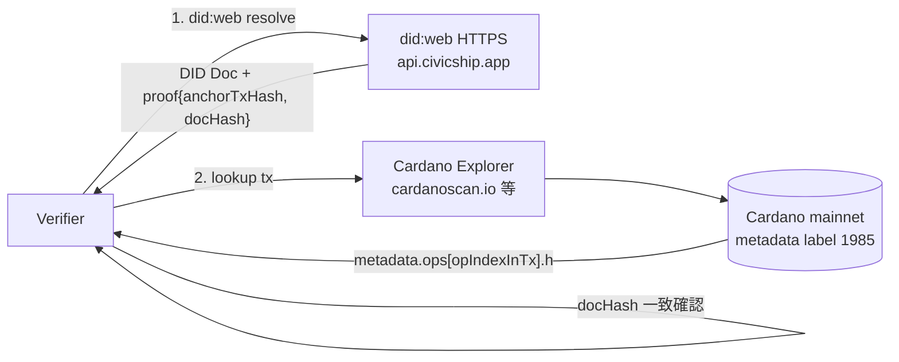

# `civicship-merkle-anchor-2026` Cryptosuite Specification

> **Status**: Draft (W3C registry 未登録、CIP-10 metadata label 未登録)
> **Identifier**: `civicship-merkle-anchor-2026`
> **Editor**: civicship-api maintainers
> **Last updated**: 2026-05-10
> **License**: 本仕様書は参考実装と同じ条件 (本リポジトリ LICENSE) で公開する

---

## 1. Identifier

```
civicship-merkle-anchor-2026
```

W3C Verifiable Credential Data Integrity の `proof.cryptosuite` フィールドにこの文字列を入れる。`-2026` の年付き suffix は、将来パラメータ (hash 関数 / canonical encoding 等) を変更した場合に世代を区別するため。新世代を切るときは `civicship-merkle-anchor-YYYY` を新規に発行し、旧世代の verifier 互換性は保持する。

## 2. Status

| 項目 | 状態 | 想定タイムライン |
|---|---|---|
| 仕様書ドラフト | 本書をもって draft 公開 | 2026 Q2 |
| W3C VC Working Group cryptosuite registry 登録申請 | **未着手** | Phase 4 完了後 |
| CIP-10 metadata label 1985 の正式登録 | **未着手** | Phase 4 完了後、CIP repo に PR 提出 |
| 参考実装の安定運用 | civicship-api Phase 1 〜 Phase 3 で実運用 | 2026 Q2 〜 Q4 |

W3C registry / CIP 登録は、`civicship.app` 内製運用が安定し、本仕様への変更がしばらく入らないことが確認できる Phase 4 完了後に行う。それまでは「civicship.app 単独での運用に閉じた independent cryptosuite」として位置付ける。

## 3. 概要

`civicship-merkle-anchor-2026` は、civicship.app が発行する `did:web` Issuer / Subject DID Document および Verifiable Credential (以下 VC) を Cardano メインネットの公開チェーンに anchor し、第三者 verifier が **civicship.app に依存しない手順で** 改ざん不能性を確認するための data-integrity proof 仕様である。

### 3.1 設計目標

1. **civicship 非依存性** — verifier は civicship.app の API を信頼することなく、`did:web` resolver と任意の Cardano explorer / Blockfrost 互換 API があれば検証を完結できる
2. **再現可能なエンコーディング** — Merkle leaf / 内部ノードの hashing は 1 bit 単位で固定し、別実装でも同じ root が得られる
3. **Cardano-native** — Cardano 自体が標準で使う Blake2b-256 を hash 関数に採用し、Cardano explorer 上の表示と整合する
4. **Phase 1 で実装可能** — 既存 OSS (`@noble/hashes`、`@openzeppelin/merkle-tree`、`@emurgo/cardano-serialization-lib-nodejs`) の組み合わせで実装でき、独自暗号プリミティブを書かない

### 3.2 検証モデル



verifier が触れるインフラは「`api.civicship.app` HTTPS (1 次解決のみ)」と「Cardano 公開チェーンの explorer」だけで、検証コード自体は OSS の did:web resolver / Blake2b ライブラリ / Merkle 検証ライブラリで完結する。詳細は [§7 検証手順](#7-検証手順外部-verifier-視点)。

## 4. Algorithms

### 4.1 Merkle Hash (Pair Hashing)

| 項目 | 値 |
|---|---|
| Hash 関数 | **Blake2b-256** (RFC 7693) |
| 出力長 | 32 バイト (`dkLen = 32`) |
| 鍵 | 使用しない (unkeyed mode) |
| Personalization | 使用しない |
| Salt | 使用しない |

ノード結合は **32 バイトの生 bytes を直接連結** したものを Blake2b-256 に通す。base16 文字列への変換は禁止する (連結時のエンコーディング揺れによる root 不一致を防ぐため)。

```
hash_pair(left, right) = blake2b256( concat_bytes(left, right) )
  where  left, right : 32-byte raw bytes
         concat_bytes(a, b) : (a || b)  // Uint8Array concat、no separator
```

### 4.2 Canonical Leaf Hash

| 項目 | 値 |
|---|---|
| 入力 | `transaction.id` (cuid 形式の ASCII 文字列) |
| エンコーディング | UTF-8 byte 列 (cuid は ASCII のみなので UTF-8 / ASCII 同一) |
| Prefix / Padding | 使用しない (`0x` prefix なし、トリミングなし) |
| Hash 関数 | Blake2b-256, dkLen=32 |

```
leaf_hash(tx_id) = blake2b256( utf8_bytes(tx_id) )
```

### 4.3 Merkle Tree 構築

OpenZeppelin の Merkle Tree 実装と互換性を保つ:

1. リーフ集合 `L = [l_0, l_1, ..., l_{n-1}]` を **`transaction.id` の ASCII 昇順 (`ORDER BY id ASC`)** で並べる
2. 各リーフを `leaf_hash` で 32 バイト hash に変換する
3. **葉が奇数の場合は最後の葉を複製して右子とする** (OpenZeppelin Merkle Tree 互換)
4. 内部ノードは `hash_pair(left, right)` で bottom-up に計算
5. 最終的に得られた 32 バイト値が **Merkle root**

```
※ ペアの順序は固定 (左右を辞書順で sort しない)。OpenZeppelin の
   "non-sorted-pair" mode を採用する。

例: 5 リーフのケース

       root
      /    \
     I0    I1
    /  \   / \
   H0  H1 H2 H3
  /  \  /\  /\  ↑ H4 を複製
 l0  l1 l2 l3 l4 l4
```

`@openzeppelin/merkle-tree` のデフォルト hash 関数は keccak256 だが、本仕様では Blake2b-256 を hash として注入する (同ライブラリは hash function injection をサポート)。

### 4.4 アルゴリズム選定の根拠

| 候補 | 採用 | 理由 |
|---|---|---|
| **Blake2b-256** | ✅ | Cardano-native、CSL 標準、Cardano explorer 上の hash 表示と整合 |
| keccak256 | ❌ | EVM 慣習で Cardano エコシステム内で異質 |
| SHA-256 | ❌ | 速度的に劣り、Cardano 用途では非標準 |

## 5. Anchor フォーマット (Cardano metadata label 1985)

civicship.app は Cardano メインネット上の transaction に **metadata label `1985`** で以下の構造を記録する。設計書 §5.1.6 / §5.1.7 抜粋。

```jsonc
{
  "v": 1,                                // schema version
  "bid": "ckxxxxxxxxxxxx",               // batch idempotency key (cuid)
  "ts": 1746336034,                      // unix epoch seconds
  "tx": {
    // 当該バッチ周期に発行された Transaction の Merkle root
    // leaf hash = blake2b256( utf8_bytes(transaction.id) )
    "root": "4a7b3c8d9e2f1a0b5c6d7e8f9a0b1c2d3e4f506172839abcdef0123456789ab",
    "count": 5213
  },
  "vc": {
    // 当該バッチ周期に発行された Verifiable Credential の Merkle root
    // leaf hash = blake2b256( utf8_bytes(vc_jwt) )
    // count = 0 の週は省略可能
    "root": "9f8e7d6c5b4a3928110010203040506070809a0b0c0d0e0f1a2b3c4d5e6f7081",
    "count": 87
  },
  "ops": [
    // DID 操作 (CREATE / UPDATE / DEACTIVATE) を Merkle 経由ではなく直接列挙
    {
      "k": "c",                          // "c"=create, "u"=update, "d"=deactivate
      "did": "did:web:api.civicship.app:users:u_xyz",
      "h": "a1b2c3d4e5f6...",            // doc hash (hex 64 chars, 0x prefix なし)
      "doc": [                           // CBOR-encoded DID Document を 64-byte 単位で list 化
        "<bytes 0..63>",
        "<bytes 64..127>"
      ],
      "prev": null                       // 前回 op の Cardano tx hash (CREATE 時は null)
    },
    {
      "k": "u",
      "did": "did:web:api.civicship.app:users:u_abc",
      "h": "c3d4...",
      "doc": ["...", "..."],
      "prev": "<prev tx hash, 64 chars>"
    }
  ]
}
```

### 5.1 Field Definitions

| フィールド | 型 | 必須 | 説明 |
|---|---|---|---|
| `v` | int | yes | schema version。本仕様は `v = 1` |
| `bid` | string (cuid) | yes | バッチの idempotency key。同 `bid` の二重 submit を verifier 側で検出可能にする |
| `ts` | int (epoch sec) | yes | バッチ作成 unix timestamp |
| `tx.root` | hex string (64 chars) | optional | Transaction Merkle root。`tx.count = 0` の周期では省略可 |
| `tx.count` | int | optional | 当該周期に集約された Transaction 数 |
| `vc.root` | hex string (64 chars) | optional | VC Merkle root |
| `vc.count` | int | optional | 当該周期に集約された VC 数 |
| `ops` | array | optional | DID 操作の直接記録。長さ 0 の周期では省略可 |
| `ops[].k` | string | yes | `"c"` / `"u"` / `"d"` のいずれか |
| `ops[].did` | string | yes | 対象 DID の文字列 |
| `ops[].h` | hex string (64 chars) | yes (k!="d") | DID Document の Blake2b-256 hash |
| `ops[].doc` | array of bytes | optional | CBOR-encoded DID Document (Cardano metadata の 64-byte 上限のため list 分割) |
| `ops[].prev` | hex string (64 chars) | yes (k!="c") | 直前 op の Cardano tx hash (hash chain) |

### 5.2 サイズ制約

Cardano metadata は単一 string / bytes フィールドが 64 バイト上限のため、長い doc は `ops[].doc` 配列に 64-byte chunk で分割する。CBOR encode は CSL (`@emurgo/cardano-serialization-lib-nodejs`) の `TransactionMetadatum.new_bytes` / `new_list` を使う。

実装サンプルは civicship-api `src/infrastructure/libs/cardano/txBuilder.ts` (設計書 §5.1.6) を参照。

### 5.3 Metadata Label `1985` の選定理由

- 2026-05-09 時点で [CIP-10 registry.json](https://github.com/cardano-foundation/CIPs/blob/master/CIP-0010/registry.json) に未登録 (collision なし)
- 1985 は語呂合わせで civicship-api 内のドキュメンタリ的な意味のみ持つ (技術的意味はない)
- Phase 4 完了後、CIP-10 へ正式登録申請する予定 ([§9 CIP 提案](#9-cip-提案) 参照)

## 6. Proof フォーマット (DID Document 内 `proof` field)

civicship-api が配信する `did:web` DID Document には、本 cryptosuite 形式の `proof` を埋め込む。

### 6.1 構造

```jsonc
{
  "@context": ["https://www.w3.org/ns/did/v1"],
  "id": "did:web:api.civicship.app:users:u_xyz",
  // ... verificationMethod / service 等
  "proof": {
    "type": "DataIntegrityProof",
    "cryptosuite": "civicship-merkle-anchor-2026",
    "anchorChain": "cardano:mainnet",
    "anchorTxHash": "abcdef0123456789abcdef0123456789abcdef0123456789abcdef0123456789",
    "opIndexInTx": 2,
    "docHash": "a1b2c3d4e5f60718293a4b5c6d7e8f9012345678abcdef0123456789abcdef01",
    "anchorStatus": "confirmed",
    "anchoredAt": "2026-05-10T00:12:34.000Z",
    "verificationUrl": "https://cardanoscan.io/transaction/abcdef0123..."
  }
}
```

### 6.2 Field Definitions

| フィールド | 型 | 必須 | 説明 |
|---|---|---|---|
| `type` | string | yes | 常に `"DataIntegrityProof"` (W3C VC Data Integrity 準拠) |
| `cryptosuite` | string | yes | 常に `"civicship-merkle-anchor-2026"` |
| `anchorChain` | string | yes | チェーン識別子。`cardano:mainnet` / `cardano:preprod` のいずれか |
| `anchorTxHash` | hex string (64 chars) or null | yes | Cardano tx hash。`anchorStatus = "pending"` の場合のみ null |
| `opIndexInTx` | int or null | yes | 当該 metadata 内 `ops[]` の index。anchor 前は null |
| `docHash` | hex string (64 chars) | yes | DID Document の Blake2b-256 hash。`metadata.ops[opIndexInTx].h` と一致するべき値 |
| `anchorStatus` | enum string | yes | `"pending"` / `"submitted"` / `"confirmed"` / `"failed"` のいずれか |
| `anchoredAt` | RFC3339 datetime or null | optional | confirm された時刻。`status = "confirmed"` 時のみ非 null |
| `verificationUrl` | URL or null | optional | Cardano explorer で当該 tx を直接開く URL (任意の便宜情報) |

### 6.3 PENDING 状態の扱い

新規発行直後 (anchor batch 実行前) の DID Document は `anchorStatus = "pending"` で配信される。verifier は以下のように扱う:

- 緩い verifier: `anchorStatus = "pending"` でも HTTPS 解決の段階で受け入れる
- 厳格な verifier: `anchorStatus = "confirmed"` を待つ (最大 7 日 = 1 weekly batch + Cardano confirmation 時間)

設計書 §5.4.4 / §F の方針を反映。

### 6.4 VC の Inclusion Proof

DID Document 自体は `ops[]` に直接乗るので Merkle proof 不要だが、VC は `vc.root` に集約されるため inclusion proof が必要になる。civicship-api は `GET /vc/{vcId}/inclusion-proof` で以下を返す:

```jsonc
{
  "leafHash": "<32-byte hex>",        // blake2b256(utf8_bytes(vc_jwt))
  "leafIndex": 42,                    // 0-indexed
  "siblings": [                       // bottom-up に並んだ sibling hash 列
    "<32-byte hex>",
    "<32-byte hex>"
  ],
  "root": "<32-byte hex>",            // 期待される Merkle root
  "chainTxHash": "<64-char hex>"      // metadata 1985 の vc.root が記録された tx
}
```

verifier は `siblings` を順に `hash_pair` で適用し `root` を再構築、`chainTxHash` の metadata.vc.root と一致を確認する。

## 7. 検証手順 (外部 verifier 視点)

設計書付録 B.1 / B.2 を本仕様向けに要約。

### 7.1 日常検証 (HTTPS のみ、~100ms)

```
1. VC JWT (または DID Document) を受領
2. did:web 形式の Issuer DID から DID Document URL を導出
   - did:web:api.civicship.app
       → https://api.civicship.app/.well-known/did.json
   - did:web:api.civicship.app:users:u_xyz
       → https://api.civicship.app/users/u_xyz/did.json
3. HTTPS GET → DID Document を取得
4. verificationMethod の公開鍵で JWT 署名を検証
5. (VC の場合) credentialStatus.statusListCredential を fetch
   → bitstring の statusListIndex bit が 0 なら not revoked
6. 結果: 真正性確認 OK
```

→ civicship.app の HTTPS / DNS 信頼に乗るのみ。Cardano は触らない。

### 7.2 監査検証 (chain で改ざん不能性まで確認、数秒〜10秒)

```
[7.1 を済ませた上で、追加で:]

7. 取得した DID Document の proof block を読む
   → { anchorTxHash, opIndexInTx, docHash, anchorStatus }
8. anchorStatus == "confirmed" を確認
9. Cardano explorer (cardanoscan.io / cexplorer.io / pool.pm) で
   anchorTxHash を開く
10. metadata label 1985 を表示
11. metadata.ops[opIndexInTx].h と proof.docHash を比較
    → 一致なら DID Document は確かに anchor 済み (改ざん不能性確認)

[VC の inclusion proof も確認したい場合:]

12. GET https://api.civicship.app/vc/{vcId}/inclusion-proof
    → { leafHash, leafIndex, siblings[], root, chainTxHash }
13. ローカルで leafHash と siblings から hash_pair を順に適用
    → root を再構築
14. Cardano explorer で chainTxHash を開き metadata.vc.root を確認
    → root が一致なら VC も確かに anchor 済み
```

検証時に依存するインフラ:

| インフラ | 役割 | civicship 依存性 |
|---|---|---|
| `api.civicship.app` HTTPS | DID Document の 1 次解決 | 必要 (did:web の前提) |
| Cardano 公開チェーン | metadata 1985 の改ざん不能性提供 | civicship に依存しない (公開) |
| Cardano explorer | metadata 表示 (cardanoscan / cexplorer / pool.pm 等) | 複数独立運営、相互独立 |
| Verifier コード | did:web resolver / Blake2b / Merkle 検証 | OSS で完結 |

→ **特定ベンダー (IOG / civicship 自身) への単一信頼に依存せず、Cardano チェーンと W3C 標準仕様だけで検証完結**する設計。

### 7.3 chain 単独検証 (civicship.app 消失時の fallback)

`api.civicship.app` が永続的に消失した場合は、metadata 1985 を時系列スキャンして DID 履歴を再構築する fallback 手順がある (設計書 §8.3)。ただし高頻度には適さないため、平常運用では §7.1 / §7.2 を使う。

## 8. W3C 登録の予定

本仕様は安定運用後、W3C Verifiable Credential Working Group が運営する [Verifiable Credentials Specifications Directory](https://w3c.github.io/vc-specs-dir/) (cryptosuite registry を兼ねる) に登録申請する。

### 8.1 タイミング

| Phase | 状態 | アクション |
|---|---|---|
| Phase 0-3 (本書時点〜2026 Q4) | civicship-api 内製運用立上げ | 仕様変更が発生し得るので登録申請しない |
| Phase 4 完了後 | 内製運用が安定 (3 ヶ月程度の無修正運用を想定) | W3C VC WG に登録申請 |

### 8.2 申請内容 (予定)

- `cryptosuite` 識別子: `civicship-merkle-anchor-2026`
- 仕様書 URL: 本ドキュメントの GitHub raw URL (`docs/specs/civicship-merkle-anchor-2026.md`)
- ステータス: Independent specification (W3C 内仕様ではないが registry には登録される)
- リファレンス実装: civicship-api (`src/infrastructure/libs/merkle/merkleTreeBuilder.ts` 等)

### 8.3 後方互換性ポリシー

- 本仕様 (`-2026`) のセマンティクスは凍結する。将来パラメータを変更する場合は新世代 (`civicship-merkle-anchor-YYYY`) を発行する
- verifier は `cryptosuite` 文字列の完全一致で世代を識別する
- 旧世代で発行された proof の検証可能性は永続維持する

## 9. CIP 提案

Cardano metadata label `1985` は 2026-05-09 時点で [CIP-10 registry.json](https://github.com/cardano-foundation/CIPs/blob/master/CIP-0010/registry.json) に未登録である。

### 9.1 タイミング

W3C 登録と同じく **Phase 4 完了後** に Cardano Foundation の CIPs リポジトリに PR を提出する。

### 9.2 申請内容 (予定)

```jsonc
{
  "1985": {
    "name": "civicship-merkle-anchor-2026",
    "description": "Anchor for did:web DID Documents and Verifiable Credentials issued by civicship.app",
    "url": "https://github.com/Hopin-inc/civicship-api/blob/master/docs/specs/civicship-merkle-anchor-2026.md"
  }
}
```

### 9.3 並行運用

CIP 登録までの期間も label 1985 で運用を続ける (CIP-10 registry は first-come-first-served で、未登録の label を実利用すること自体はプロトコル違反ではない)。CIP PR が他者の同 label 利用と競合した場合の調整方針:

- 他者がより早く同 label を利用していた事実が確認できれば civicship.app 側が別 label に migrate する
- そのときは新 cryptosuite 世代 (`civicship-merkle-anchor-YYYY`) を切って anchor フォーマットを更新し、旧 anchor の検証手順は本仕様で永続維持する

## 10. References

### 10.1 設計書 (`docs/report/did-vc-internalization.md`)

| Section | 内容 |
|---|---|
| §3.4 | 採用ライブラリ (`@noble/hashes`、`@openzeppelin/merkle-tree`、CSL) |
| §5.1.6 | `txBuilder.ts` (Cardano metadata 1985 構造) |
| §5.1.7 | `merkleTreeBuilder.ts` (canonical leaf encoding 仕様、Blake2b-256 採用根拠) |
| §5.4 | 公開 API (`/.well-known/did.json` / `/users/:id/did.json` / `/vc/:vcId/inclusion-proof`) |
| §11 | 段階的リリース (Phase 0 PoC 〜 Phase 4 IDENTUS 撤去) |
| 付録 B | 外部 verifier 視点の検証フロー |

### 10.2 外部仕様

- **RFC 7693** — The BLAKE2 Cryptographic Hash and Message Authentication Code (MAC). https://datatracker.ietf.org/doc/html/rfc7693
- **W3C DID Core** — Decentralized Identifiers (DIDs) v1.0. https://www.w3.org/TR/did-core/
- **W3C VC Data Integrity** — Verifiable Credential Data Integrity 1.0. https://www.w3.org/TR/vc-data-integrity/
- **W3C did:web Method Specification** — https://w3c-ccg.github.io/did-method-web/
- **W3C BitstringStatusList** — https://www.w3.org/TR/vc-bitstring-status-list/
- **CIP-10** — Transaction Metadata Label Registry. https://github.com/cardano-foundation/CIPs/tree/master/CIP-0010

### 10.3 参考実装

- civicship-api (本リポジトリ): `src/infrastructure/libs/merkle/merkleTreeBuilder.ts`、`src/infrastructure/libs/cardano/txBuilder.ts`、`src/presentation/router/did.ts`
- `@openzeppelin/merkle-tree`: https://github.com/OpenZeppelin/merkle-tree (hash function injection 対応)
- `@noble/hashes` (Blake2b-256): https://github.com/paulmillr/noble-hashes
- `@emurgo/cardano-serialization-lib-nodejs` (CSL): https://github.com/Emurgo/cardano-serialization-lib

---

## 11. Change Log

| Date | Author | Change |
|---|---|---|
| 2026-05-10 | civicship-api maintainers | 初版 (Draft) を公開。Phase 1 step 3 で本書を `docs/specs/` に追加 |
