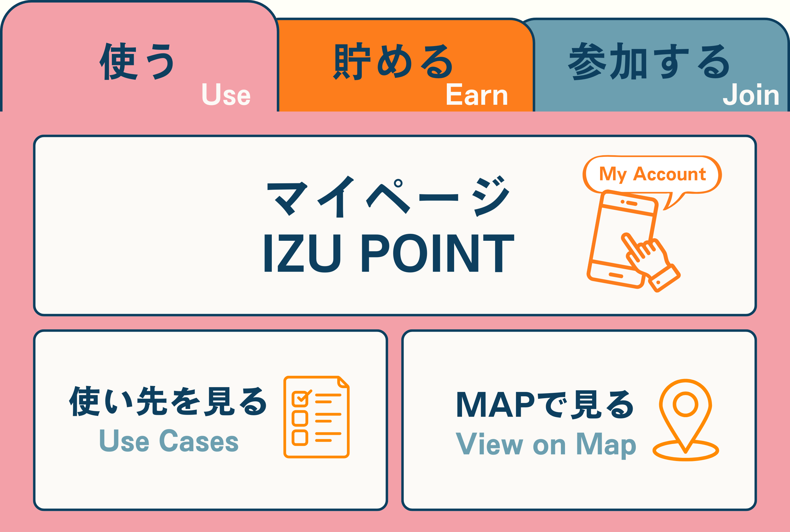

# 新しいコミュニティを立ち上げる

このページは、civicship 上で新しいコミュニティを立ち上げたい団体（自治体・NPO・企業など）の
ご担当者さま向けの手順書です。お申し込みから公開までの流れと、事前にご準備いただく情報を
まとめています。

> **はじめに（前提）**
> 導入を始める前に、civicship 運営との **基本規約・個別契約の締結が必要**です（ステップ1）。
> 契約締結後に、LINE 公式アカウントの準備などへ進みます。
>
> **だれが作成するの？**
> コミュニティの作成作業そのものは、**civicship の運営チームが代行**します。
> （システム上、コミュニティの新規作成は運営管理者の権限でのみ行えます。）
> ご担当者さまには、下記の準備・情報をそろえたうえでお申し込みいただく形になります。

---

## 全体の流れ

1. **契約の締結**：civicship 運営と基本規約・個別契約を締結
2. **LINE 公式アカウントの準備**：公式アカウントを作成し、civicship 運営を管理者として招待
3. **お申し込み**：ご担当者さま → 運営へ必要情報を提出
4. **内容確認**：運営が情報を確認（不足があればお問い合わせ）
5. **コミュニティ作成**：運営がコミュニティを作成
6. **初期セットアップ**：ロゴ・ポータル・LINE 連携などを反映
7. **公開・引き継ぎ**：ご担当者さまをオーナーとして登録し、運用開始

作成が完了すると、お申し込みいただいたご担当者さまが自動的に
**オーナー（管理者）** としてコミュニティに参加し、コミュニティ専用の
ポイント残高（ウォレット）も同時に用意されます。

---

## ステップ1：契約の締結（必須・最初）

コミュニティの導入を始める前に、**civicship 運営との契約締結が必要**です。次の2種類があります。

| 契約 | 内容 |
| --- | --- |
| **基本規約** | civicship 利用全体にかかわる基本的な取り決め（最初に一度締結） |
| **個別契約** | 導入するコミュニティ・案件ごとの個別の取り決め |

**基本規約・個別契約の締結が完了してから、以降の準備・お申し込みに進みます。**
契約の内容・手続きの詳細は、担当者からご案内します。

---

## ステップ2：LINE 公式アカウントの作成と運営の招待（必須）

civicship のコミュニティは **LINE 連携を前提に運用します。** そのため、契約締結後に
LINE 公式アカウントをご準備いただく必要があります。

1. **LINE 公式アカウントを作成する**
   （[LINE 公式アカウント](https://www.linebiz.com/jp/service/line-official-account/) から開設）
2. **Messaging API を利用できる状態にする**
3. **civicship 運営チームを、公式アカウントの管理者として招待する**

招待が完了すると、運営側で **チャネル ID・チャネルシークレット・アクセストークン・LIFF などの
連携情報を取得し、コミュニティに設定**します。そのため、これらの機密情報をご担当者さまが
メール等で送付していただく必要はありません。

> 💡 招待先となる運営チームのアカウントは、担当者からご案内します。

### リッチメニューの画像とタップ先リンクをご準備ください（必須）

LINE のリッチメニュー（トーク画面下部に表示されるメニュー）には、**メニュー画像**と、
各ボタンの**タップ先リンク（URL）**が必要です。以下をご準備のうえ、運営にお渡しください。

- **リッチメニュー画像**
- **各タップ領域のタップ先リンク（URL）**

#### リッチメニューの例

実際のコミュニティで使われているリッチメニューの例です（デザイン・項目はコミュニティごとに異なります）。

> 📌 **リッチメニュー変更について**
> リッチメニューの変更は **3ヶ月に1回まで無料**で承ります。デザインを変更すると
> タップ領域の境界も作り直す必要があり手間がかかるため、頻繁な変更はご相談ください。

### （参考）運営側で取得・設定する LINE 連携情報

ご担当者さまの作業ではありませんが、運営側では招待後に以下を取得・設定します。

| 項目 | 説明 |
| --- | --- |
| チャネル ID（channelId） | LINE 公式アカウントのチャネル ID |
| チャネルシークレット（channelSecret） | チャネルのシークレットキー |
| アクセストークン（accessToken） | チャネルアクセストークン |
| LIFF ID（liffId） | LIFF アプリの ID |
| LIFF ベース URL（liffBaseUrl） | LIFF アプリのベース URL |

---

## ステップ3：必須情報を準備する

最低限、以下の3点が必要です。

| 項目 | 説明 | 例 |
| --- | --- | --- |
| **コミュニティ名** | 表示される正式名称 | `姫路 YMCA コミュニティ` |
| **ポイント名** | コミュニティ内で使うポイントの呼び名 | `YMCA ポイント` |
| **コミュニティID（originalId）** | システム内部で使う識別子（後述のルールあり） | `himeji-ymca` |

### コミュニティID（originalId）のルール

コミュニティ ID は、後から変更がむずかしい大切な識別子です。次のルールを必ず守ってください。

- **半角英字で始める**（数字やハイフンで始めることはできません）
- 使える文字は **半角英字（a〜z, A〜Z）・数字（0〜9）・ハイフン（-）** のみ
- **長さは 4〜20 文字**
- 記号（`_` アンダースコアなど）、スペース、日本語は使えません

| 例 | 可否 | 理由 |
| --- | --- | --- |
| `himeji-ymca` | ✅ | ルールを満たしている |
| `CommunityA1` | ✅ | ルールを満たしている |
| `1himeji` | ❌ | 数字で始まっている |
| `abc` | ❌ | 4文字未満 |
| `himeji_ymca` | ❌ | アンダースコアは使用不可 |
| `姫路ymca` | ❌ | 日本語は使用不可 |

---

## ステップ4：あると望ましい情報（任意）

設定しておくと、コミュニティの見栄えや信頼感が向上します。後からの追加・変更も可能です。

| 項目 | 説明 |
| --- | --- |
| **ロゴ画像** | コミュニティのロゴ（画像ファイル） |
| **紹介文（bio）** | コミュニティの説明文 |
| **ウェブサイト** | 公式サイトの URL |
| **設立日** | コミュニティの設立日 |

---

## ステップ5：ポータル設定（任意）

コミュニティのポータルサイトの見た目や機能をカスタマイズできます。指定しない場合は、
標準の設定が自動的に適用されます。

| 項目 | 説明 | 未指定時の動作 |
| --- | --- | --- |
| ポータルのタイトル | ブラウザや見出しに表示される名前 | コミュニティ名を使用 |
| ポイント表示名 | ポータル上のポイントの呼び名 | ポイント名を使用 |
| 説明文 / 短い説明 | ポータルの紹介テキスト | 空欄 |
| カスタムドメイン | 独自ドメインで公開する場合の指定 | 設定なし（任意・後から設定可） |
| 有効化する機能 | 利用する機能の選択 | `ポイント` / `justDaoIt` / `言語切り替え` が有効 |
| ファビコン / ロゴ / 正方形ロゴ / OG 画像 | 各種ブランド画像 | 設定なし（任意・後から設定可） |
| 地域名・地域キー | 地域に紐づく表示 | 設定なし（任意・後から設定可） |
| 利用規約・プライバシーポリシー | 標準文面のカスタマイズ | 標準文面を使用 |

---

## ステップ6：作成後に行われること

運営がコミュニティを作成すると、システム上で自動的に次の処理が行われます。

- コミュニティ本体の作成
- お申し込みご担当者さまを **オーナー** として登録（メンバーシップ作成）
- コミュニティ用ウォレットの作成（ポイント配布の元になる残高）
- オーナー個人のウォレットの作成（ポイント保有用）
- 入力いただいた設定（ポータル・LINE 連携など）の反映

これらが完了した時点で、コミュニティの運用を開始できます。

---

## よくある質問

**Q. 契約は必要ですか？**
A. はい。導入を始める前に、civicship 運営との **基本規約**と**個別契約**の締結が必要です。
契約締結後に LINE 公式アカウントの準備やお申し込みに進みます。詳細は担当者からご案内します。

**Q. LINE 連携は必須ですか？**
A. はい。civicship のコミュニティは LINE 連携を前提に運用するため、LINE 公式アカウントのご準備
（作成と運営チームの管理者招待）が必須の最初のステップになります。

**Q. チャネルシークレットやアクセストークンを自分で渡す必要はありますか？**
A. 不要です。公式アカウントの管理者として運営チームを招待いただければ、運営側で連携情報を取得・設定します。

**Q. リッチメニューは何を用意すればよいですか？**
A. メニュー画像と、各ボタンのタップ先リンク（URL）をご準備ください。

**Q. リッチメニューは後から変更できますか？**
A. はい。**3ヶ月に1回まで無料**で変更を承ります。デザイン変更時はタップ領域の境界も作り直しになるため、
それ以上の頻度での変更はご相談ください。

**Q. コミュニティ ID（originalId）は後から変更できますか？**
A. コミュニティ ID は内部識別子として広く使われるため、原則として変更できません。
申し込み前によくご確認ください。

**Q. 自分たちでコミュニティを作成することはできますか？**
A. 現在、新規作成は civicship 運営側で行っています。必要情報をご提出いただければ運営が代行します。

**Q. ロゴや設定は後から変更できますか？**
A. はい。名前・紹介文・ロゴ・ポータル設定・LINE 連携などは、作成後でも更新できます。
コミュニティ ID（originalId）のみ変更できない点にご注意ください。

---

## お申し込みチェックリスト

申し込み前に、以下が揃っているか確認してください。

- [ ] 基本規約を締結した
- [ ] 個別契約を締結した
- [ ] LINE 公式アカウントを作成した
- [ ] LINE 公式アカウントの管理者として civicship 運営を招待した
- [ ] リッチメニュー画像
- [ ] リッチメニューの各タップ先リンク（URL）
- [ ] コミュニティ名
- [ ] ポイント名
- [ ] コミュニティ ID（originalId、ルールを満たしているか）
- [ ] （任意）ロゴ画像・紹介文・ウェブサイト・設立日
- [ ] （任意）ポータル設定の希望

---

## お問い合わせ

コミュニティの導入・契約・お申し込みに関するご相談は、以下までご連絡ください。

- メール：[info@hopin.co.jp](mailto:info@hopin.co.jp)
